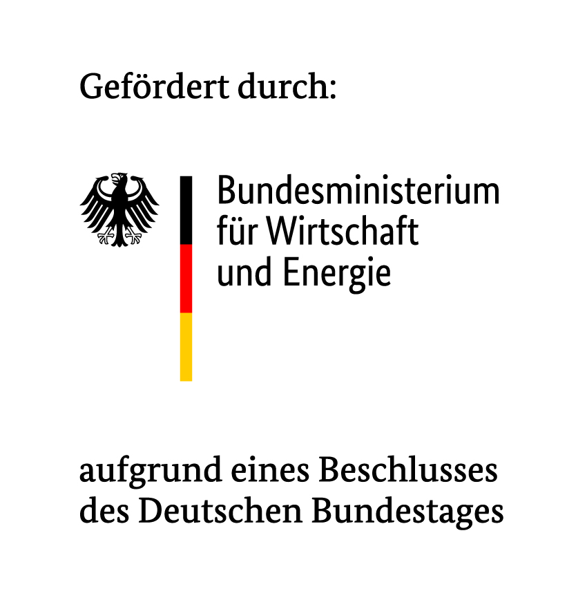

[](https://pypi.python.org/pypi/hisim)
[](LICENSE)
[](https://household-infrastructure-simulator.readthedocs.io/en/latest/)

<a href="https://www.fz-juelich.de/en/iek/iek-3"></a>

# ETHOS.HiSim - Household Infrastructure and Building Simulator

ETHOS.HiSim is a Python package for simulation and analysis of household scenarios and building systems using modern
components as alternative to fossil fuel based ones. This package integrates load profiles generation of electricity
consumption, heating demand, electricity generation, and smart strategies of modern components, such as
heat pump, battery, electric vehicle or thermal energy storage. ETHOS.HiSim is a package under development by
Forschungszentrum Jülich and Hochschule Emden/Leer. For detailed documentation, please
access [ReadTheDocs](https://household-infrastructure-simulator.readthedocs.io/en/latest/) of this repository.


Clone Repository
-----------------------
To clone this repository, enter the following command to your terminal:

```bash
git clone https://github.com/FZJ-IEK3-VSA/HiSim.git
```

Virtual Environment
-----------------------
`ETHOS.HiSim` needs Python 3.11 or newer.
Before installing `ETHOS.Hisim`, it is recommended to set up a Python virtual environment. Let `hisimvenv` be the name of
virtual environment to be created. For Windows users, from inside the cloned HiSim directory, the environment is
created with:

```bash
python -m venv hisimvenv
```

After its creation, the virtual environment can be activated in the same directory:

```powershell
hisimvenv\Scripts\activate
```

For Linux/Mac users, the virtual environment is set up and activated as follows:

```bash
python3 -m venv hisimvenv
source hisimvenv/bin/activate
```

Alternatively, Anaconda can be used to set up and activate the virtual environment:

```bash
conda create -n hisimvenv python=3.11
conda activate hisimvenv
```

With the successful activation, `ETHOS.HiSim` is ready to be locally installed.

Install Package
------------------------
After setting up the virtual environment, install the package to your local libraries:

```bash
pip install -e .
```

Optional: Graphviz for system charts
-----------------------
If you want to use the feature that generates system charts, you need to install GraphViz in your system. If you don't
have Graphviz installed, you will experience error messages about a missing dot.exe under Windows.

Follow the installation instructions from here:
https://www.graphviz.org/download/

(or simply disable the system charts)

Optional: Set Environment Variables
-----------------------
Certain components might access APIs to retrieve data. In order to use them, you need to set the url and key as environment variables. This can be done with an `.env` file within the HiSim root folder or with system tools. The environment variables are:

```
UTSP_URL
UTSP_API_KEY
```

They are needed only when the occupancy is taken from the UTSP connector
(`hisim/components/loadprofilegenerator_utsp_connector.py`) in its `USE_UTSP` data-acquisition mode; the
`USE_PREDEFINED_PROFILE` and `USE_LOCAL_LPG` modes of the same component do without them. Both the `hisim`
console script and `hisim/hisim_main.py` call `load_dotenv()` on start-up, so either of them reads an `.env` file from
the repository root without anything else being set.

Executing a Building Simulation
-----------------------
In `ETHOS.HiSim` a simulated household is described by two files, both kept in the directory `energy_systems`.
An energy-system file (`*.energy_system.yaml`) says what the household **is**: its components, how each of them is
configured and where each takes its inputs from. A simulation file (`*.simulation.yaml`) says what to **do** with it:
the period, the time-step length and the post-processing to run. The two are never mixed, so the same household can be
run over a day and over a year without a second copy of it. The format is documented in
[`energy_systems/README.md`](energy_systems/README.md). Both files are handed to `hisim`, a console script that
`pip install -e .` installs together with the package.

Run Simple System Setups
-----------------------
We provide some simplified examples to show the general principles of the simulation.
From the repository root, run one of them with the following command:

```bash
hisim energy-system run energy_systems/simple_system_setup_one.energy_system.yaml energy_systems/one_day_15min.simulation.yaml
```
or

```bash
hisim energy-system run energy_systems/simple_system_setup_two.energy_system.yaml energy_systems/one_day_15min.simulation.yaml
```

This runs the household given by the first file over the period given by the second one: a single January day at a
quarter-hour resolution, which finishes in seconds. Each run writes its results into a new, time-stamped directory
under `energy_systems/results/`, named after the energy-system file (for example
`energy_systems/results/simple_system_setup_one.energy_system_<date>_<time>/`), and prints that path as its last
line. `python hisim/hisim_main.py` followed by the same two files is equivalent.

Run Basic Household System Setup
-----------------------
The directory `energy_systems` also contains a basic household named `basic_household.energy_system.yaml`.
It can be executed with the following command, which simulates the whole of 2021 at a one-minute resolution and draws
the standard plots — a few minutes rather than seconds:

```bash
hisim energy-system run energy_systems/basic_household.energy_system.yaml energy_systems/2021_minutely.simulation.yaml
```

The system is set up with the following elements:

* Occupancy (residents' demands) from the LoadProfileGenerator connector
* Weather
* Photovoltaic system
* Electricity meter
* Building
* Heat-pump controller
* Heat pump

Hence, photovoltaic modules and the heat pump are responsible for covering the electricity and thermal energy demands as
best as possible. The components are explicitly connected to each other, binding inputs to their corresponding output
sequentially. This is different from automatically connecting inputs and outputs based on similarity. For a better
understanding of explicit connection, proceed to section `Connecting Input/Outputs`.

Three more `hisim` commands help when reading or writing such files:

* `hisim energy-system describe <full.class.Name>` prints what one class can be configured with: its fields, its named
  presets, its named constructors and its sizable fields.
* `hisim energy-system facts <file>` prints where a file's sized values would come from, without running it.
* `hisim energy-system schema` writes the JSON Schema that editors bind to (`hisim/energy_system_v3.schema.json`).

Package Structure
-----------
The main program is executed from `hisim/hisim_main.py`. The `Simulator` (`hisim/simulator.py`) object groups the `Components` declared in the energy-system file. The `ComponentWrapper` (`hisim/simulator.py`) gathers together the `Components` inside a `Simulator` object. The `Simulator` object performs the entire simulation under the function `run_all_timesteps` and stores the results in a time-stamped directory under `energy_systems/results/` named after the energy-system file, such as `energy_systems/results/simple_system_setup_one.energy_system_<date>_<time>/`.

Plots, KPIs, CSV-files and the PDF-report can be generated by the class `PostProcessor` (`hisim/postprocessing/postprocessing_main.py`).
For this you list the respective `PostProcessingOptions` (`hisim/postprocessingoptions.py`) under `post_processing_options` in the simulation file: `energy_systems/2021_minutely.simulation.yaml` selects the plots, `energy_systems/one_day_15min.simulation.yaml` only the CSV export.

Component Classes
-----------
All HiSim component classes are stored in the `hisim/components` directory and inherit from the parent class `Component` (`hisim/component.py`). They can be used in your energy-system file to customize different configurations.
Every component has a `ConfigBase` dataclass holding its parameters and a `DisplayConfig` controlling its visibility in reports.
A `Component` child class has to have the following methods implemented:

* i_prepare_simulation: called once before the time-step loop
* i_save_state: updates previous state variable with the current state variable
* i_restore_state: updates current state variable with the previous state variable
* i_simulate: performs a timestep iteration for the `Component`
* i_doublecheck: checks if the values are expected throughout the iteration

These methods are used by `Simulator` to execute the simulation and generate the results.
To write a component of your own, copy `hisim/components/example_template.py`: it shows the config dataclass, the inputs and outputs, a saved and restored state and the `i_simulate` method.

List of `Component` Children
-----------
These classes inherit from `Component` (`component.py`) and live in the `hisim/components` directory. Grouped by what they do:

- Building and weather: `Building` (`building/building.py`), `Weather` (`weather.py`)
- Occupancy: `UtspLpgConnector` (`loadprofilegenerator_utsp_connector.py`), which takes the residents' profiles from the LoadProfileGenerator through the UTSP, from a local LoadProfileGenerator or from a shipped profile
- Generation: `PVSystem` (`generic_pv_system.py`), `SimpleCHP` (`generic_chp.py`)
- Heat supply: `GenericHeatPump` (`generic_heat_pump.py`) and `MoreAdvancedHeatPumpHPLib` (`more_advanced_heat_pump_hplib.py`), `GenericBoiler` for gas, oil, pellets, wood chips and hydrogen (`generic_boiler.py`), `DistrictHeating` (`generic_district_heating.py`), `ElectricHeating` (`generic_electric_heating.py`), `SolarThermalSystem` (`solar_thermal_system.py`)
- Storages: `SimpleWaterStorage` for hot water and buffer tanks (`simple_water_storage.py`), `Battery` (`advanced_battery_bslib.py`), `HydrogenStorage` (`generic_electrolyzer_and_h2_storage.py`)
- Mobility: `Car` (`generic_car.py`), `L1Controller` for charging the car's battery (`controller_l1_generic_ev_charge.py`)
- Meters and controllers: `ElectricityMeter` (`electricity_meter.py`), `GasMeter` (`gas_meter.py`), `FuelMeter` (`fuel_meter.py`), `HeatingMeter` (`heating_meter.py`); `GenericHeatPumpController` (`generic_heat_pump.py`), `L2GenericEnergyManagementSystem` (`controller_l2_energy_management_system.py`)

`hisim energy-system describe <full.class.Name>` prints what any of them can be configured with, and the [components page of the documentation](https://household-infrastructure-simulator.readthedocs.io/en/latest/components.html) lists all of them.

Connecting Input/Outputs
-----------
In the following the basic principle of the `Component` connections is explained.

Every component entry of an energy-system file lists where its inputs come from under `inputs:`. The `Building` of `energy_systems/basic_household.energy_system.yaml` shows the two spellings side by side:

```yaml
  Building:
    class: hisim.components.building.building.Building
    preset: standard
    config:
      weather_identity: Aachen/DWD_TRY/weather/test-reference-years_1995-2012_1-location/data_processed/aachen_center
    inputs:
      - Weather
      - UTSPConnector
      - input: ThermalPowerDelivered
        from: HeatPump.ThermalPowerDelivered
```

A bare component name such as `- Weather` says: connect this source through the default connections the `Building` class declares for components of `Weather`'s class. Nothing about ports appears in the file, so a component that gains an input does not force every file using it to be edited. The explicit pair names both ports: the building's input `ThermalPowerDelivered` is fed from the heat pump's output of the same name. A file names every connection itself — the simulator's automatic wiring is switched off for energy-system files — so an input a file leaves out stays unconnected, and a mandatory input left open is refused before the first time step.

Running the tests
-----------
`pytest -m base` runs the fast suite. [TESTING.md](TESTING.md) lists what a change has to pass before it counts as done: the lint, `pytest -m "base or buildingtest"` and `python scripts/golden_check.py`, which compares simulation outputs with the golden references within a tolerance — references that a change never regenerates on its own. The test markers, including the slower `system_setups`, `mpc` and `utsp` suites, are declared in `pytest.ini`.

## Contributions and Collaborations
ETHOS.HiSim welcomes any kind of feedback, contributions, and collaborations.
If you are interested in joining the project, adding new features, or providing valuable insights, feel free to reach out (email to k.rieck@fz-juelich.de) and participate in our bi-weekly HiSim developer meetings. Additionally, we encourage you to utilize our Issue section to share feedback or report any bugs you encounter.
How to set up a development copy, run the checks and submit a pull request is described in [CONTRIBUTING.rst](CONTRIBUTING.rst).
We look forward to your contributions and to making meaningful improvements.
Happy coding!

## License

MIT License

Copyright (C) 2020-2026 Noah Pflugradt, Leander Kotzur, Detlef Stolten, Tjarko Tjaden, Kevin Knosala, Sebastian Dickler, Katharina Rieck, David Neuroth, Johanna Ganglbauer, Vitor Zago, Frank Burkard, Maximilian Hillen, Marwa Alfouly, Franz Oldopp, Markus Blasberg, Kristina Dabrock, Valentin Janser, Nicolai Gölz, Felix Schattmann, Jonas Hoppe

You should have received a copy of the MIT License along with this program.
If not, see https://opensource.org/licenses/MIT

## About Us

<a href="https://www.fz-juelich.de/en/ice/ice-2"></a>

We are the [Institute of Climate and Energy Systems - Juelich Systems Analysis](https://www.fz-juelich.de/en/ice/ice-2) belonging to the [Forschungszentrum Jülich](https://www.fz-juelich.de/en). Our interdisciplinary institute's research is focusing on energy-related process and systems analyses. Data searches and system simulations are used to determine energy and mass balances, as well as to evaluate performance, emissions and costs of energy systems. The results are used for performing comparative assessment studies between the various systems. Our current priorities include the development of energy strategies, in accordance with the German Federal Government’s greenhouse gas reduction targets, by designing new infrastructures for sustainable and secure energy supply chains and by conducting cost analysis studies for integrating new technologies into future energy market frameworks.

## Contributions and Users

Development Partners:

**Hochschule Emden/Leer** inside the project "Piegstrom".

**4ward Energy** inside the EU project "WHY" and the FFG project "[AI4CarbonFreeHeating](https://www.4wardenergy.at/de/referenzen/ai4carbonfreeheating)"

## Acknowledgement

This work was supported by the Helmholtz Association under the Joint
Initiative ["Energy System 2050   A Contribution of the Research Field Energy"](https://www.helmholtz.de/en/research/energy/energy_system_2050/).

<a href="https://www.helmholtz.de/en/"></a>

For this work weather data is based on data from ["German Weather Service (Deutscher Wetterdienst, DWD)"](https://www.dwd.de/DE/Home/home_node.html) ([terms of use](https://www.dwd.de/DE/service/rechtliche_hinweise/rechtliche_hinweise_node.html)) and ["NREL National Solar Radiation Database"](https://nsrdb.nrel.gov/data-viewer/download/intro/) (License: Creative Commons Attribution 3.0 United States License, Creative Commons BY 4.0); individual values are averaged.

<a href="https://www.dwd.de/"></a>

This project has received funding from the European Union’s Horizon 2020 research and innovation programme under grant agreement No. 891943. 

</a>

<a href="https://www.why-h2020.eu/"></a>

This project has received funding from the FFG under the topic “Digital Technologies”, an initiative of the Federal Ministry for Climate Action, Environment, Energy, Mobility, Innovation and Technology (BMK), through the project "[AI4CarbonFreeHeating](https://www.4wardenergy.at/de/referenzen/ai4carbonfreeheating)" 

<a href="https://www.4wardenergy.at/de/referenzen/ai4carbonfreeheating"></a>


This project has received funding from the Federal Ministry for Economic Affairs and Climate Actions (BMWK.IIB4) under the WAAGE Grant Program (Grant No. 03EI1044/03EE5031D).

</a>
