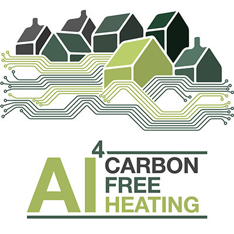

 [](https://pypi.python.org/pypi/hisim)
 [](LICENSE)
 
 <a href="https://www.fz-juelich.de/en/iek/iek-3"></a> 

# ETHOS.HiSim - Household Infrastructure and Building Simulator

ETHOS.HiSim is a Python package for simulation and analysis of household scenarios and building systems using modern
components as alternative to fossil fuel based ones. This package integrates load profiles generation of electricity
consumption, heating demand, electricity generation, and smart strategies of modern components, such as
heat pump, battery, electric vehicle or thermal energy storage. ETHOS.HiSim is a package under development by
Forschungszentrum Jülich und Hochschule Emden/Leer. For detailed documentation, please
access [ReadTheDocs](https://household-infrastructure-simulator.readthedocs.io/en/latest/) of this repository.


# Install Graphviz

If you want to use the feature that generates system charts, you need to install GraphViz in your system. If you don't
have Graphviz installed, you will experience error messages about a missing dot.exe under Windows.

Follow the installation instructions from here:
https://www.graphviz.org/download/

(or simply disable the system charts)

Clone Repository
-----------------------
To clone this repository, enter the following command to your terminal:

```python
git clone https://github.com/FZJ-IEK3-VSA/HiSim.git
```

Virtual Environment
-----------------------
Before installing `ETHOS.Hisim`, it is recommended to set up a Python virtual environment. Let `hisimvenv` be the name of
virtual environment to be created. For Windows users, setting the virtual environment in the path `\Hisim` is done with
the command line:

```python
python -m venv hisimvenv
```

After its creation, the virtual environment can be activated in the same directory:

```python 
hisimvenv\Scripts\activate
```

For Linux/Mac users, the virtual environment is set up and activated as follows:

```python 
virtual hisimvenv source hisimvenv/bin/activate
```

Alternatively, Anaconda can be used to set up and activate the virtual environment:

```python 
conda create -n hisimvenv python=3.9
conda activate hisimvenv
```

With the successful activation, `ETHOS.HiSim` is ready to be locally installed.

Install Package
------------------------
After setting up the virtual environment, install the package to your local libraries:

```python
pip install -e .
```

Optional: Set Environment Variables
-----------------------
Certain components might access APIs to retrieve data. In order to use them, you need to set the url and key as environment variables. This can be done with an `.env` file wihtin the HiSim root folder or with system tools. The environment variables are:

```
UTSP_URL
UTSP_API_KEY
```

Run Simple System Setups
-----------------------
Run the python interpreter in the `HiSim/system_setups` directory with the following command:

```python
python ../hisim/hisim_main.py simple_system_setup_one.py
```
or

```python
python ../hisim/hisim_main.py simple_system_setup_two.py
```

This command executes `hisim_main.py` on the setup function `setup_function` implemented in the files `simple_system_setup_one.py` and `simple_system_setup_two.py` that are stored in `HiSim/system_setups`.
The results can be visualized under directory `results` created under the same directory where the script with the setup function is located.

Run Basic Household System Setup
-----------------------
The directory `HiSim/system_setups` also contains a basic household configuration in the script `basic_household.py`.
It can be executed with the following command:

```python
python ../hisim/hisim_main.py basic_household.py
```

The system is set up with the following elements:

* Occupancy (Residents' Demands)
* Weather
* Photovoltaic System
* Building
* Heat Pump

Hence, photovoltaic modules and the heat pump are responsible for covering the electricity and thermal energy demands as
best as possible. As the name of the setup function says, the components are explicitly connected to each other, binding
inputs to their corresponding output sequentially. This is different from automatically connecting inputs and outputs
based on similarity. For a better understanding of explicit connection, proceed to section `IO Connecting Functions`.

Generic Setup Function Walkthrough
---------------------
The basic structure of a setup function is as follows:

1. Set the simulation parameters (See `SimulationParameters` class in `hisim/hisim/component.py`)
1. Create a `Component` object and add it to `Simulator` object
    1. Create a `Component` object from one of the child classes implemented in `hisim/hisim/components`
        1. Check if `Component` class has been correctly imported
    1. If necessary, connect your object's inputs with previous created `Component` objects' outputs.
    1. Finally, add your `Component` object to `Simulator` object
1. Repeat step 2 while all the necessary components have been created, connected and added to the `Simulator` object.

Once you are done, you can run the setup function according to the description in the simple system setup run.

Package Structure
-----------
The main program is executed from `hisim/hisim/hisim_main.py`. The `Simulator`(`simulator.py`) object groups `Component`s declared and added from the setups functions. The `ComponentWrapper` (`simulator.py`) gathers together the `Component`s inside a `Simulator` object. The `Simulator` object performs the entire simulation under the function `run_all_timesteps` and stores the results in a Python pickle `data.pkl` in a subdirectory of `hisim/hisim/results` named after the executed setup function. Plots and the report are automatically generated from the pickle by the class `PostProcessor` (`hisim/hisim/postprocessing/postprocessing.py`).

Component Class
-----------
A child class inherits from the `Component` class in `hisim/hisim/component.py` and has to have the following methods implemented:

* i_save_state: updates previous state variable with the current state variable
* i_restore_state: updates current state variable with the previous state variable
* i_simulate: performs a timestep iteration for the `Component`
* i_doublecheck: checks if the values are expected throughout the iteration

These methods are used by `Simulator` to execute the simulation and generate the results.

List of `Component` Children
-----------
Theses classes inherent from `Component` (`component.py`) class and can be used in your setup function to customize different configurations. All `Component` class children are stored in `hisim/hisim/components` directory. Some of these classes are:

- `RandomNumbers` (`random_numbers.py`)
- `SimpleWaterStorage` (`simple_water_storage.py`)
- `Transformer` (`transformer_rectifier.py`)
- `PVSystem` (`generic_pv_system.py`)
- `SimpleCHP` (`generic_chp.py`)
- `CSVLoader` (`csvloader.py`)
- `SumBuilderForTwoInputs` (`sumbuilder.py`)
- `SumBuilderForThreeInputs` (`sumbuilder.py`)
- ToDo: more components to be added

Connecting Input/Outputs
-----------
Let `my_home_electricity_grid` and `my_appliance` be `Component` objects used in the setup function. The object `my_apppliance` has an output `ElectricityOutput` that has to be connected to an object `ElectricityGrid`. The object `my_home_electricity_grid` has an input `ElectricityInput`, where this connection takes place. In the setup function, the connection is performed with the method `connect_input` from the `Simulator` class:

```python
my_home_electricity_grid.connect_input(input_fieldname=my_home_electricity_grid.ELECTRICITY_INPUT,
                                       src_object_name=my_appliance.component_name,
                                       src_field_name=my_appliance.ELECTRICITY_OUTPUT)
```

Configuration Automator
-----------
A configuration automator is under development and has the goal to reduce connections calls among similar components.

Post Processing
-----------
After the simulator runs all time steps, the post processing (`postprocessing.py`) reads the persistent saved results, plots the data and generates a report.

## Contributions and Collaborations
ETHOS.HiSim welcomes any kind of feedback, contributions, and collaborations. 
If you are interested in joining the project, adding new features, or providing valuable insights, feel free to reach out (email to k.rieck@fz-juelich.de) and participate in our HiSim developer meetings held every second Monday. Additionally, we encourage you to utilize our Issue section to share feedback or report any bugs you encounter.
We look forward to your contributions and to making meaningful improvements. 
Happy coding!

## License

MIT License

Copyright (C) 2020-2021 Noah Pflugradt, Leander Kotzur, Detlef Stolten, Tjarko Tjaden, Kevin Knosala, Sebastian Dickler, Katharina Rieck, David Neuroth, Johanna Ganglbauer, Vitor Zago, Frank Burkard, Maximilian Hillen, Marwa Alfouly, Franz Oldopp, Markus Blasberg, Kristina Dabrock

You should have received a copy of the MIT License along with this program.
If not, see https://opensource.org/licenses/MIT

## About Us

<a href="https://www.fz-juelich.de/en/ice/ice-2"></a>

We are the [Institute of Climate and Energy Systems - Juelich Systems Analysis](https://www.fz-juelich.de/en/ice/ice-2) belonging to the [Forschungszentrum Jülich](www.fz-juelich.de/en). Our interdisciplinary institute's research is focusing on energy-related process and systems analyses. Data searches and system simulations are used to determine energy and mass balances, as well as to evaluate performance, emissions and costs of energy systems. The results are used for performing comparative assessment studies between the various systems. Our current priorities include the development of energy strategies, in accordance with the German Federal Government’s greenhouse gas reduction targets, by designing new infrastructures for sustainable and secure energy supply chains and by conducting cost analysis studies for integrating new technologies into future energy market frameworks.

## Contributions and Users

Development Partners:

**Hochschule Emden/Leer** inside the project "Piegstrom".

**4ward Energy** inside the EU project "WHY" and the FFG project "[AI4CarbonFreeHeating](https://www.4wardenergy.at/de/referenzen/ai4carbonfreeheating)"

## Acknowledgement

This work was supported by the Helmholtz Association under the Joint
Initiative ["Energy System 2050   A Contribution of the Research Field Energy"](https://www.helmholtz.de/en/research/energy/energy_system_2050/).

<a href="https://www.helmholtz.de/en/"></a>

For this work weather data is based on data from ["German Weather Service (Deutscher Wetterdienst-DWD)"](https://www.dwd.de/DE/Home/home_node.html/, https://www.dwd.de/DE/service/rechtliche_hinweise/rechtliche_hinweise_node.html) and ["NREL National Solar Radiation Database"](https://nsrdb.nrel.gov/data-viewer/download/intro/) (License: Creative Commons Attribution 3.0 United States License, Creative Commons BY 4.0); individual values are averaged.

<a href="https://www.dwd.de/"></a>

This project has received funding from the European Union’s Horizon 2020 research and innovation programme under grant agreement No. 891943. 

</a>

<a href="https://www.why-h2020.eu/"></a>

This project has received funding from the FFG under the topic “Digital Technologies”, an initiative of the Federal Ministry for Climate Action, Environment, Energy, Mobility, Innovation and Technology (BMK), through the project "[AI4CarbonFreeHeating](https://www.4wardenergy.at/de/referenzen/ai4carbonfreeheating)" 

<a href="https://www.4wardenergy.at/de/referenzen/ai4carbonfreeheating"></a>

