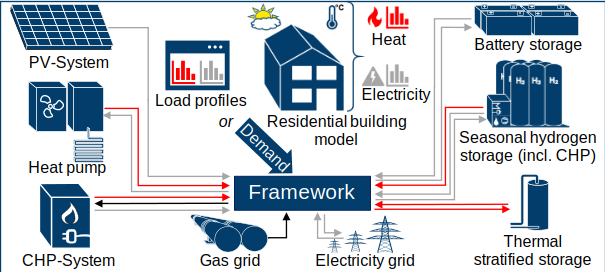

.. Building Energy Simulator documentation master file, created by
   sphinx-quickstart on Thu Oct  7 17:06:08 2021.
   You can adapt this file completely to your liking, but it should at least
   contain the root `toctree` directive.

.. image:: http://www.fz-juelich.de/SharedDocs/Bilder/IBG/IBG-3/DE/Plant-soil-atmosphere%20exchange%20processes/INPLAMINT%20(BONARES)/Bild3.jpg?__blob=poster
    :target: http://www.fz-juelich.de/iek/iek-3/EN/Forschung/_Process-and-System-Analysis/_node.html
    :width: 230px
    :alt: Forschungszentrum Juelich Logo
    :align: right

Welcome to HiSim's documentation!
==========================================================

`HiSim` is an open-source Python-package for simulation in building energy systems, and has been under continuous development as part of the project PiegStrom. `HiSim` contains a time step simulation engine and an extendable framework for integration. The `HiSim` includes multiple components that as discrete elements define together the entire of a designed building energy system. Some of the current included components are Building, PV-System, Battery, Seasonal Hydrogen Storage, Gas Heater, Weather and Occupancy Load Profiles (See :numref:`scheme`)

.. _scheme:

   HiSim Scheme

The goal of this package to enable a free fast to implement investigation of different building energy system strategies considering the many load profiles, physical conditions and alternative components from fossil fuel sources. The user can also design their own components to be implemented in its own building energy system.

Please, check the :ref:`installation` procedures to install `HiSim` in your local machine.

.. toctree::
   :maxdepth: 1
   :caption: Contents:

   installation
   tutorial
   strategy
   componentsworkflow
   modules

Documentation Reference
==============================

* :ref:`genindex`
* :ref:`modindex`
* :ref:`search`

About Us
==================

.. figure:: https://github.com/OfficialCodexplosive/README_Assets/blob/master/iek3-wide.png?raw=true
   :target: https://www.fz-juelich.de/iek/iek-3/DE/Home/home_node.html
   :align: center
   :alt: IEK-3 Team

   Forschungszentrum Jülich IEK-3 Team

We are the `Institute of Energy and Climate Research - Techno-economic Systems Analysis (IEK-3) <https://www.fz-juelich.de/iek/iek-3/DE/Home/home_node.html>`_ belonging to the `Forschungszentrum Jülich <https://www.fz-juelich.de>`_. Our interdisciplinary institute's research is focusing on energy-related process and systems analyses. Data searches and system simulations are used to determine energy and mass balances, as well as to evaluate performance, emissions and costs of energy systems. The results are used for performing comparative assessment studies between the various systems. Our current priorities include the development of energy strategies, in accordance with the German Federal Government’s greenhouse gas reduction targets, by designing new infrastructures for sustainable and secure energy supply chains and by conducting cost analysis studies for integrating new technologies into future energy market frameworks.

License
=========================================================

HiSim is distributed under `MIT License <https://github.com/FZJ-IEK3-VSA/HiSim/blob/main/LICENSE>`_ .

Copyright (C) 2020-2021 Noah Pflugradt, Vitor Zago, Frank Burkard, Tjarko Tjaden, Leander Kotzur, Detlef Stolten

Contribution
============================================================

This software is developed together with the **Hochschule Emden/Leer** inside the project `Piegstrom` and `4wardEnergy Research  <https://www.4wardenergy.at/en>`_ inside the EU project `WHY <https://www.why-h2020.eu>`_. 

Acknowledgement
================================================
.. |tag1| image:: https://www.helmholtz.de/fileadmin/user_upload/05_aktuelles/Marke_Design/logos/HG_LOGO_S_ENG_RGB.jpg
   :width: 200px

.. |tag2| image:: https://www.dwd.de/SharedDocs/bilder/DE/logos/dwd/dwd_logo_258x69.png?__blob=normal&v=1
   :width: 200px

This work was supported by the `Helmholtz Association <https://www.fz-juelich.de/iek/iek-3/EN/Home/home_node.html>`_ under the Joint Initiative `Energy System 2050 - A Contribution of the Research Field Energy <https://www.helmholtz.de/en/research/energy/energy_system_2050/>`_ .

|tag1|

For this work weather data is based on data from `German Weather Service (Deutscher Wetterdienst-DWD) <https://www.dwd.de/DE/Home/home_node.html/>`_, individual values are averaged.

|tag2|

This project has received funding from the European Union’s Horizon 2020 research and innovation programme under grant agreement No 891943. 

|tag3| |tag4|

.. _iek3link: