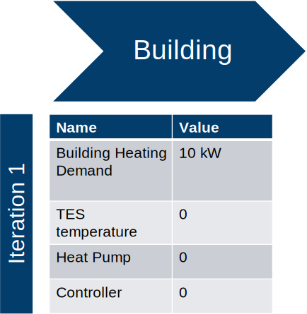

.. House Infrastructure Simulator documentation master file, created by
   sphinx-quickstart on Thu Oct  7 17:06:08 2021.
   You can adapt this file completely to your liking, but it should at least
   contain the root `toctree` directive.

Welcome to BESIM's documentation!
==========================================================

What is BESIM?

It is an open-source Python-package for simulation in building energy systems, similar to Polysun and TRNSYS, and has been under continuous development as part of the project PiegStrom. ``BESIM`` contains a time step simulation engine and an extendable framework for integration.

Time Step Simulation Principle:
-------------------------------

A building energy system can be composed of multiple components, e.g., ``Building``, ``Thermal Energy Storage`` (TES), ``Heat Pump``, ``Battery``, ``Photovoltaic system`` or ``Electric Vehicle``. In such a system, the components are interconnected, exchanging information, mass fluxes or energy within every time step. These connections take place though inputs and outputs.

Inputs and outputs are nothing but shared values among the components. In other words, once a component performed its internal calculations, all its output values are updated, and so are the input values of other components that they are connected to. The updated input values are used for the internal calculation, which themselves generate new output values, and so on progressively through all components.

:numref:`circularsubstitution`.

.. _timestepsimulation:

.. figure:: img/time_step_simulation.svg
   :width: 400
   :align: center
   :alt: Alternative text

   Building Energy System and its Components Connections
..
   [comment] BESIM is using currently the simplest convergence method: Circular Substitution with an Anti-Oscillation-Switch. The framework splits the time into discrete steps
   where every run the calculation for each time step
   * Each component is called with the input values from the previous component.
   * But there are frequently circular dependencies.
   * Those require a solver inside a step.
   * The solver needs to iterate until a solution is reached.

In some cases, a chain of associations, a building energy system might have a circular connection as seen by :numref:`timestepsimulation`:

Circular Substitution with an Anti-Oscillation-Switch Method:
-------------------------------------------------------------

Circular Substitution works in an iterative manner within one single time step, overwriting common shared inputs and outputs among the components. To illustrate this concept, take a home energy system containing a building, a heat pump controller, a heat pump and a thermal energy storage depicted in :numref:`circularsubstitution`.

Once the setup function has been implemented and the components and connects have been passed to the Simulator, the simulator itself run all the internal calculations time steps for every single component, sequentially, as they were added to the simulator. To correctly determine the values of all outputs for a specific time step, the Simulator performs multiple iterations. The process of going through these iterations and converging to the correct outputs is called Anti-Oscillation-Switch.

In the :numref:`circularsubstitution` example, the Simulator starts with the Building. In the first try of the current time step, the component `Building` carries the values of the previous time step. Since this is the first time step, all default values are set to zero. Once ``Simulator`` performs the internal calculation of ``Building``, the output `Building Heating Demand` is updated, as shown in :numref:`buildingfirstiteration` .

.. _buildingfirstiteration:

   Component Building in the first iteration

Next, ``Simulator`` performs the internal calculation of ``Thermal Energy Storage``. Since this is the first time step as well, the output values is filled with the simulation start value as shown in :numref:`btesiter`.

.. _btesiter:

.. figure:: img/building_tes_iteration_1.svg
   :width: 400
   :align: center
   :alt: Building and TES in the first iteration

   Building and TES in the first iteration

Analogously, ``Simulator`` performs the internal calculation of ``Heat Pump`` and ``Heat Pump Controller``. Given the heating requirement from ``Building``, ``Heat Pump`` and ``Heat Pump Controller`` updates their outputs to start the heating process, as shown in :numref:`firstiteration`.

.. _firstiteration:

.. figure:: img/iteration_1.svg
   :width: 600
   :align: center
   :alt: First Iteration

   First Iteration

..
   [comment] the building perform its internal calculations and update the output values.
   [comment]
   [comment] * Call first component
   [comment] * Feed Output of the first component to the second component
   [comment] * All values that are not available yet stay 0
   [comment] * Then feed output of component 1 and 2 to the 3rd component
   [comment] * Repeat in a circle until values stop changing (convergence)
   [comment]

If after 10 iterations no convergence has been reached, tell all oscillating components to just stick to the last value. (Anti-Oscillation-Switch)

.. _circularsubstitution:

.. figure:: img/hisim_iterations.svg
  :width: 800
  :align: center
  :alt: Alternative text

  Circular Substitution

Installation
---------------------------------------------------------

Please, check the :ref:`installation` procedures to install ``BESIM`` in your local machine.

Modules
==========================================================

.. toctree::
   :maxdepth: 1
   :caption: Contents:

   modules
   installation
   tutorial

* :ref:`genindex`
* :ref:`modindex`
* :ref:`search`

About Us
==================

.. figure:: https://www.fz-juelich.de/SharedDocs/Bilder/IEK/IEK-3/Abteilungen2015/VSA_DepartmentPicture_2019-02-04_459x244_2480x1317.jpg?__blob=normal
   :target: https://www.fz-juelich.de/iek/iek-3/DE/Home/home_node.html
   :align: center
   :alt: IEK-3 Team

   Forschungszentrum Jülich IEK-3 Team

We are the `Institute of Energy and Climate Research - Techno-economic Systems Analysis (IEK-3) <https://www.fz-juelich.de/iek/iek-3/DE/Home/home_node.html>`_ belonging to the `Forschungszentrum Jülich <https://www.fz-juelich.de>`_. Our interdisciplinary institute's research is focusing on energy-related process and systems analyses. Data searches and system simulations are used to determine energy and mass balances, as well as to evaluate performance, emissions and costs of energy systems. The results are used for performing comparative assessment studies between the various systems. Our current priorities include the development of energy strategies, in accordance with the German Federal Government’s greenhouse gas reduction targets, by designing new infrastructures for sustainable and secure energy supply chains and by conducting cost analysis studies for integrating new technologies into future energy market frameworks.

License
=========================================================
BESIM is distributed under `MIT License <https://github.com/FZJ-IEK3-VSA/BESIM/blob/main/LICENSE>`_ .

Copyright (C) 2020-2021 Noah Pflugradt, Vitor Zago, Frank Burkard, Tjarko Tjaden, Leander Kotzur, Detlef Stolten

Contribution
============================================================

This software is developed together with the **Hochschule Emden/Leer** inside the project "Piegstrom".

Acknowledgement
================================================

This work was supported by the Helmholtz Association under the Joint Initiative `Energy System 2050 - A Contribution of the Research Field Energy <https://www.helmholtz.de/en/research/energy/energy_system_2050/>`_.

.. _iek3link:

.. figure:: https://www.helmholtz.de/fileadmin/user_upload/05_aktuelles/Marke_Design/logos/HG_LOGO_S_ENG_RGB.jpg
   :target: https://www.fz-juelich.de/iek/iek-3/EN/Home/home_node.html
   :align: left
   :width: 200
   :alt: Helmholtz Logo

