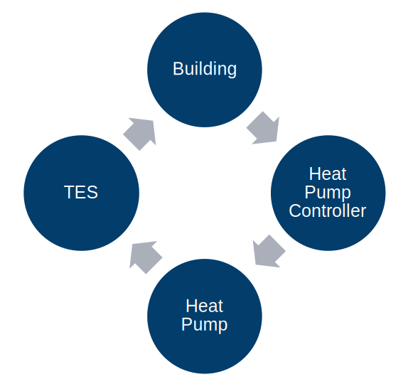
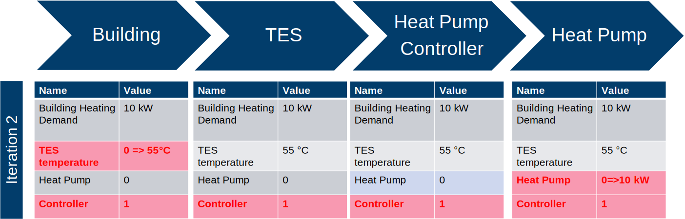
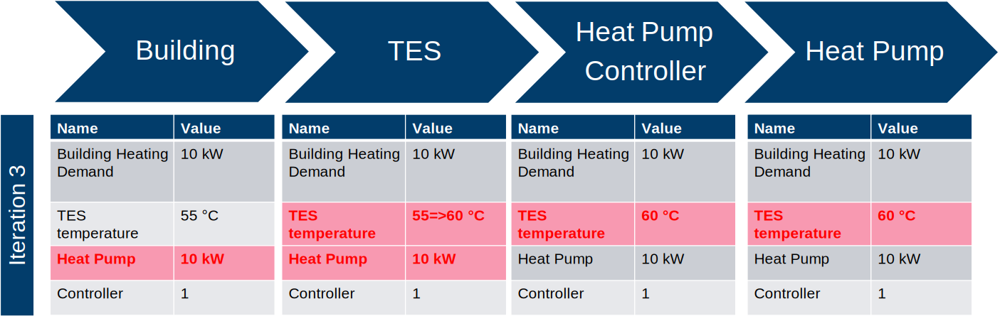
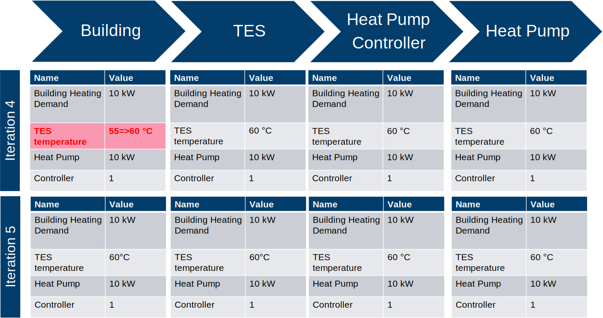

.. _strategy:

Simulation Convergence Strategy
==================================

A building energy system can be composed of multiple components, e.g., ``Building``, ``Thermal Energy Storage`` (TES), ``Heat Pump``, ``Battery``, ``Photovoltaic System`` or ``Electric Vehicle``. Based on its relations, components can be interconnected, exchanging information, mass fluxes or energy within every time step.
Under `HiSim`, these components and connections together form the `setup function`, which later is passed to ``Simulator`` to perform the calculations.

For instance, take the building energy system containing ``Building``, ``Weather``, ``Photovoltaic System`` and ``Occupancy`` depicted in :numref:`noncircularsystem`. Component ``Weather`` has the output `irradiance` that is the input itself of ``Building`` and ``Photovoltaic System``,
to calculate the building thermal equilibrium and electricity generation respectively. Component ``Occupancy`` has outputs as `number of residents` which is used as input by ``Building`` to calculate heat naturally generated by human bodies.

.. _noncircularsystem:

.. figure:: _images/non_circular_system.svg
   :width: 300
   :align: center
   :alt: None

   Non Circular Building Energy System

Certain building energy system might contain circular dependencies as in the case of :numref:`circularsystem`. In this setup function, ``Building`` provides information to ``Heat Pump Controller``, that itself activates the ``Heat Pump``, that heats the ``Thermal Energy Storage``, that heats the ``Building``.

.. _circularsystem:

   Circular Building Energy System and its Components Connections

Inputs and outputs are nothing but shared values among the components. In other words, once a component performed its internal calculations, all its output values are updated, and so are the input values of other components that they are connected to. The updated input values are used for the internal calculation, which themselves generate new output values, and so on progressively throughout all components.

In the case of circular dependencies, a once previously calculated value can be overwritten, leading to the uncertainty values for the building energy system. This `Circular Substitution` is complemented by `HiSim` framework with the `Anti-Oscillation-Switch Method` to determine all the values of the simulation.

Circular Substitution with an Anti-Oscillation-Switch Method
-------------------------------------------------------------

Circular Substitution works in an iterative manner within one single time step, overwriting common shared inputs and outputs among the components. To illustrate this concept, take the building energy system depicted in :numref:`circularsystem`.

Once the `setup function` has been implemented and the components and connects have been passed to the ``Simulator``, the simulator itself run all the internal calculations time steps for every single component, sequentially, as they were added to the simulator. To correctly determine the values of all outputs for a specific time step, the ``Simulator`` performs multiple trial iterations within that time setup.

Before starting the trials, all values are filled by default with zero. For the :numref:`` example, the ``Simulator`` starts with the component ``Building``. In the first iteration of the current time step, the component ``Building`` requires heating, yielded in the new update output. Once ``Simulator`` performs the internal calculation of ``Building``, the output `Building Heating Demand` is updated, as shown in :numref:`buildingfirstiteration` .
Circular Substitution works in an iterative manner within one single time step, overwriting common shared inputs and outputs among the components. To illustrate this concept, take the building energy system depicted in :numref:`circularsystem`.

.. _buildingfirstiteration:

.. figure:: _images/building_iteration_1.svg
   :width: 250
   :align: center
   :alt: Building In The First Iteration

   Component Building in the first iteration

Next, ``Simulator`` performs the internal calculation of ``Thermal Energy Storage``. Since this is the first time step as well, the output values is filled with the simulation start value as shown in :numref:`btesiter`. The `Building Heating Demand` is kept the same as the result from the ``Building`` calculation.

.. _btesiter:

.. figure:: _images/building_tes_iteration_1.svg
   :width: 400
   :align: center
   :alt: Building and TES in the first iteration

   Building and TES in the first iteration

Analogously, ``Simulator`` performs the internal calculation of ``Heat Pump`` and ``Heat Pump Controller``. Given the heating requirement from ``Building``, ``Heat Pump`` and ``Heat Pump Controller`` update their outputs to start the heating process, as shown in :numref:`firstiteration`. As ``Building`` requires heating, ``Heat Pump Controller`` passes an activation signal to ``Heat Pump``.

.. _firstiteration:

.. figure:: _images/iteration_1.svg
   :width: 600
   :align: center
   :alt: First Iteration

   First Iteration

For the next iteration, as the ``Heat Pump`` receives the signal for activation, it updates its heating power, which itself starts the heating process of the ``Thermal Energy Storage``, as shown in :numref:`seconditeration`

.. _seconditeration:

   Second Iteration

Because the ``Thermal Energy Storage`` is being heated up, its initial thermal energy cannot be the same as its start value. Hence, its temperature is once again updated with a higher value, as shown in :numref:`thirditeration`.

.. _thirditeration:

   Third Iteration

Finally, the correct temperature of the ``Thermal Energy Storage`` is reiterated until all values converged in the iteration 4 and 5 as shown in :numref:`fourthfifthiteration`.

.. _fourthfifthiteration:

   Forth and Fifth Iteration

In case after 10 iterations no convergence has been reached, ``Simulator`` would tell all oscillating components to just stick to the last value. Forcing the components to stick to the last iterated value is the technique called Anti-Oscillation-Switch.
