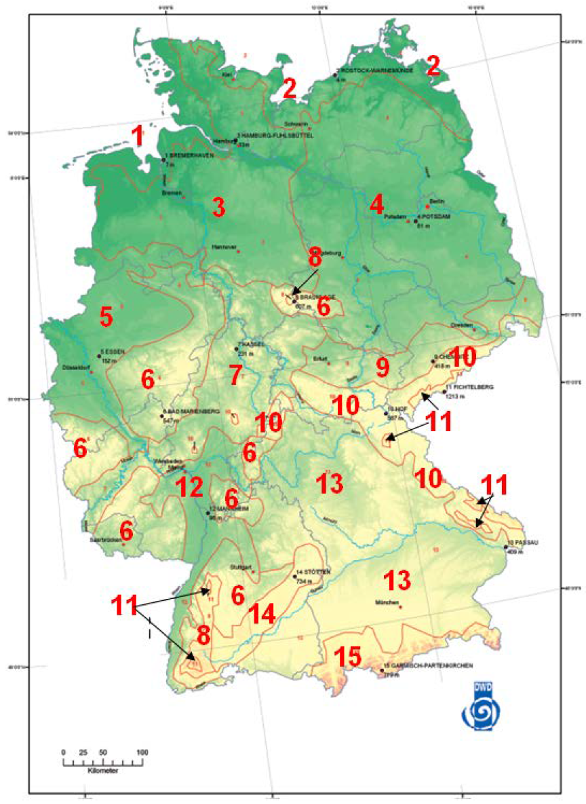

# Test Reference Years (TRY) for 15 typical regions in germany with special regards on realisitc radiation data on a 1min timescale

## Sources and License:

[](https://doi.org/10.5281/zenodo.5105765) [](https://creativecommons.org/licenses/by/4.0/)

`data_raw`-> Raw data from DWD: https://kunden.dwd.de/obt/

`data_synthetic` -> Synthetic 1min radiation data: http://pvmodelling.org/ 

## Summary:

The data set contains the updated test reference years (TRY) of the German Weather Service (DWD). By subdividing into 15 TRY regions, each postcode area can be assigned a representative weather data set. It should be emphasized that in addition to a mean, current test reference year for a region, there is also a year with extreme summer and extreme winter weather. To take climate change into account, there is then a time series for the year 2045 for each test reference year based on the IPCC climate models. This means that a total of 90 weather data sets are available with a one-hour time resolution.

In order to use the data in simulations with a temporal resolution of 1min or 15min, the data set was extended by linear interpolation. While this approach is justifiable for air pressure and temperature, for example, it does not depict high fluctuations in solar radiation. Therefore, based on the one-minute open data measurement data set of the Baseline Surface Radiation Network, with an algorithm by Hofmann et. al. the time series of global radiation are newly generated for all test reference years. Another algorithm by Hofmann et. al. was used to calculate the corresponding diffuse radiation times series.

Final datasets are located in -> `data_processed`

## Test reference stations / regions

No. | lon | lat | station | region
--- | --- | --- | --- | ---
1 | 53.5591 | 8.5872 | Bremerhaven | Nordseeküste
2 | 54.0878 | 12.1088 | Rostock | Ostseeküste
3 | 53.5299 | 10.0078 | Hamburg | Nordwestdeutsches Tiefland
4 | 52.3938 | 13.0651 | Potsdam | Nordostdeutsches Tiefland
5 | 51.4562 | 7.0568 | Essen | Niederrheinisch-westfälische Bucht und Emsland
6 | 550.6461 | 7.9426 | Bad Marienburg | Nördliche und westliche Mittelgebirge, Randgebiete
7 | 51.3334 | 9.4725 | Kassel | Nördliche und westliche Mittelgebirge, zentrale Bereiche
8 | 51.7239 | 10.6069 | Braunlage | Oberharz und Schwarzwald (mittlere Lagen)
9 | 50.8233 | 12.9181 | Chemnitz | Thüringer Becken und Sächsisches Hügelland
10 | 50.3226 | 11.9124 | Hof | Südöstliche Mittelgebirge bis 1000 m
11 | 50.4312 | 12.9522 | Fichtelberg | Erzgebirge, Böhmer- und Schwarzwald oberhalb 1000 m
12 | 49.4902 | 8.4637 | Mannheim | Oberrheingraben und unteres Neckartal
13 | 48.2432 | 12.5286 | Mühldorf | Schwäbisch-fränkisches Stufenland und Alpenvorland
14 | 48.6536 | 9.8666 | Stötten | Schwäbische Alb und Baar
15 | 47.4945 | 11.1046 | Garmisch Partenkirchen | Alpenrand und -täler



## Content

* **files**: 90 test reference years (TRY)

```
15 test reference regions
x 3 reference conditions (average year, extreme summer, extreme winter)
x 2 reference projections (year 2015 and year 2045)
```

* **columns per file**:

```
datetime [yyyy-MM-dd hh:mm:ss+01:00/02:00]
temperature [degC]
pressure [hPa]
wind direction [deg]
wind speed [m/s]
cloud coverage [1/8]
humidity [%]
direct irradiance [W/m^2]
diffuse irradiance [W/m^2]
synthetic global irradiance [W/m^2]
synthetic diffuse irradiance [W/m^2]
clear sky irradiance [W/m^2]
```

* **length**: 1 year

* **time increment**: 1min / 15min / 60min

## Important hints:

- all files in `data_processed` were calculated with the skript `process_data.ipynb`
- *A value with, for example, a timestamp 12:00:00 represents the mean value from this timestamp until the following timestamp.*
- *datetime column is in CET / CEST*
