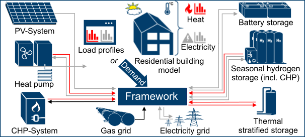

---
title: 'HiSim: House Infrastructure Simulation'
tags:
  - Python
  - House Demand Side Management
  - Home Load Profile
authors:
  - name: Vitor Hugo Bellotto Zago
    orcid: 0000-0002-3791-4557
    affiliation: 1
  - name: Dr. Noah Pflugradt
    orcid: 0000-0002-1982-8794
    affiliation: 1
  - name: Maximilian Hillen
    orcid: 0000-0002-8171-2661
    affiliation: 1
  - name: Lukas Langenberg
    orcid: 0000-0001-6713-9291
    affiliation: 1
affiliations:
 - name: Forschungszentrum Jülich, Jülich, Germany
   index: 1
date: 1 October 2021
bibliography: paper.bib
---
# []
# Summary

High volatility and low availability of renewables are the major hurdles in combating climate
change. Strategies based on Demand Side Management (DSM), e.g., peak clipping and load shifting,
combined with technologies to improve renewables flexibilities, e.g., storage and Power-to-X,
are possible solutions, that can be addressed at the consumer household level. The Python package ``HiSim``
developed in Forschungszentrum J\"{u}lich integrates these technologies and strategies in one interface
for simulation and analysis of the scope of viable scenarios.

Modern households and their residents employ a variety of devices to suffice the basic needs.
Given the house structure and the family behavior, the overall usage of these devices during a
certain period of time yields electricity consumption and thermal demand profiles. With support
of Load Profile Generator [@pflugradt2016modellierung] and model 5R1C [@ISO13790] equipped with
dataset of European housing sector, the Python package ``HiSim`` provides means to determine
electricity, heating and cooling demands for many house and family configurations down to a 1 min resolution.

As alternative to fossil fuel based appliances, ``HiSim`` uses a variety of components such as
photovoltaic systems, batteries, electric vehicles, EV chargers and heat pumps. Photovoltaic system
and batteries are responsible to generate and storage electricity respectively, while electric vehicles
and heat pumps substitute conventional fossil fuel based vehicles and appliances. Photovoltaic systems
implementation is supported the pvlib library [@holmgren2018pvlib], while the other components are based
on commercial technical data from current market devices.

# Acknowledgements

# A statement of need
Simulation and analysis of home demand side management strategies require either commercial software
([@witzig2010polysun,@carrasco2010pv]) and a combination of a plethora of tools ([@holmgren2018pvlib,@pflugradt2016modellierung]), that can be only compatible through manually merging.
The ``HiSim`` library uses a pipeline for more better flexibility, packing up these tools and current appliances:

- Popular photovoltaic Python library pvlib [@holmgren2018pvlib], to simulate PV system electricity generation
(https://doi.org/10.5281/zenodo.5366883)
- European building stock database by EPISCOPE/TABULA [@loga2016tabula], covering the most common houses from multiple European countries.
- Thermal Building 5R1C [@jayathissa2017optimising][@ISO13790] to calculate household heating and cooling demands for an entire year.
- Load Profile Generator [@pflugradt2016modellierung], behavior simulator that generates electricity and warm water load profiles.
- Database for appliances:
    - Heat pumps
    - Batteries
    - EV chargers
    - Washing machines
    - Thermal Energy Storages
    - Dishwashers
    - Electric Vehicles

The devices, load profiles and controllers are structured as components. The connection among the components
are based on compatibility and desired control over their functionality. These components are ordered and connected
to form a setup function. The setup defined by user is passed to the``HiSim``framework, which links all the inputs
and outputs of the components as shown in the figure below [@inproceedings].

<!---

-->

After connecting and testing all the links, the ``HiSim`` framework  performs all the time steps
simulations for the user defined timeline. The postprocessing automatically outputs carpet, sankey, line plots and
generate a final report of the simulation run.

# Target audience
The scientific community involved in household energy management and building optimization can find here a great tool
to investigate different configurations for a transition to low carbon emission households.

# Acknowledgements

The development of the HiSim library was conducted by Forschungszentrum Jülich, with later participation of Hochschule Emden/Leer. The work was funded by FUNDING.

# References
