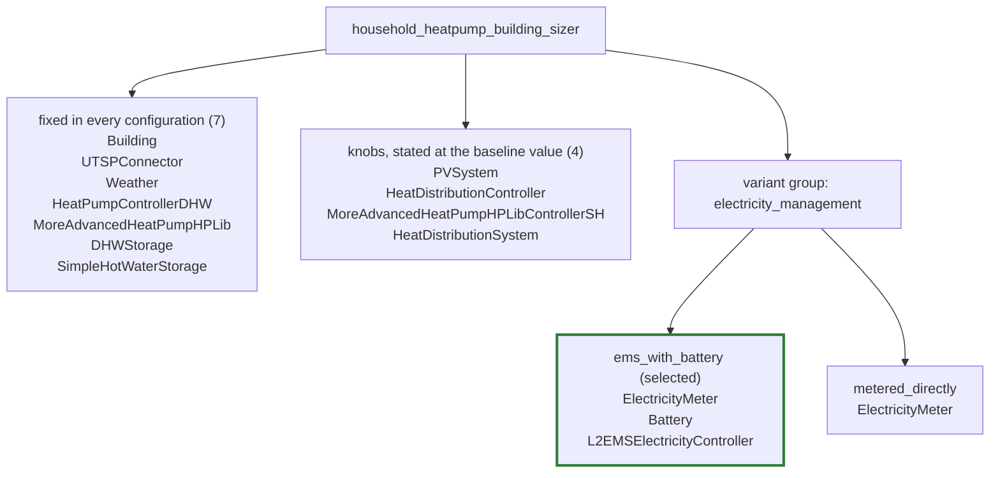

<!--
Generated by `hisim energy-system grouping overview` from the committed `*.grouping.yaml`
files and the grouped energy-system files they produced. Do not edit by hand: every number,
name and note on this page is read out of those files, and an edit here is lost the next time
the command runs. To change what this page says, change the grouping table or re-record.
-->

# Grouping overview

*Generated from the committed grouping tables and grouped energy-system files by `hisim energy-system grouping overview`. Do not edit by hand.*

## Fleet

| Setup | Variant groups | Options | Components per option | Overrides |
| --- | --- | --- | --- | --- |
| `household_heatpump_building_sizer` | `electricity_management` | **`ems_with_battery`** [^baseline], `metered_directly` | 3, 1 | 4 |

[^baseline]: The option in bold is the one the grouped file selects, which is the option the baseline probe column realizes. A grouped file's `variants:` section names it as `selected:`.

The `Overrides` column counts the components the grouping table assigns `override`, not the individual values the pass reports as consumer knobs; one override component can carry several knobbed values, and a component that belongs to a variant option can carry knobbed values too.

One of the 22 recorded setups is grouped so far. The other 21 have flat twins only: a single recorded energy-system file per setup, with no probe list, no grouping table and no `variants:` section, so nothing on this page can be said about them yet.

## `household_heatpump_building_sizer`

Recorded from `system_setups/household_heatpump_building_sizer.py`, described in the grouped file as "Basic household new system setup." 11 components are shared by every configuration, and one variant group, `electricity_management`, chooses between `ems_with_battery` and `metered_directly`. Four of the shared components are overrides, which means the grouped file states the baseline's value for them and a consumer sets that value to something else.

### Shape

`ElectricityMeter` appears under both options because it is assigned to the group rather than to one option: it is present in every configuration, and each option writes it out in full with its own wiring. The first two boxes together are the grouped file's shared `components:` section — eleven components, of which the four knobs are the ones whose committed value a consumer replaces — and each option box is that option's own `components:` block, so every component of the setup is on this picture exactly where the grouped file puts it.

### Assignments

| Component | Assignment | Judgement |
| --- | --- | --- |
| `ElectricityMeter` | `variant:electricity_management` | Present in every configuration and wired differently: fed by the energy manager's grid balance when there is one, and by every participant directly when there is not. A group can add and remove a component but cannot rewire one that survives, so this is the row that forces a variant. Written out in full in both options. |
| `Battery` | `variant:electricity_management/ems_with_battery` | Exists only in the world that has an energy manager; the setup builds the two together and there is no battery-without-manager mode. Its capacity also follows the rooftop share, which stays a knob on top of the membership. |
| `L2EMSElectricityController` | `variant:electricity_management/ems_with_battery` | The other half of that world, and the component the meter's two wirings are about. |
| `PVSystem` | `override` | Only the installed peak power moves, and only with the rooftop share. Nothing appears or disappears, so this is a number a consumer picks, not a part of the household. |
| `HeatDistributionController` | `override` | Radiators change the flow temperature curve this controller is built from. Same component, same wiring, different numbers - a knob, not a switch. |
| `MoreAdvancedHeatPumpHPLibControllerSH` | `override` | Follows the distribution system's temperatures for the same reason as the controller above. |
| `HeatDistributionSystem` | `override` | Radiator or floor heating is one enum plus the mass flow and area derived from it. The emitter is present either way. |

Ordering rule: variant assignments first, then overrides. Within the variant assignments, groups in the order the grouped file's `variants:` section lists them; within a group, the members assigned to the group as a whole before the members assigned to a single option, then the options in the order that section lists them, and within each option the order that option's `components:` block lists them. Within the overrides, the order the shared `components:` section lists them. The judgement text is the note from the grouping table in full, with the YAML line wrapping undone.

### Probe configurations

| Probe column | What it varies | `electricity_management` | Gist |
| --- | --- | --- | --- |
| `baseline` | class defaults | `ems_with_battery` | The class defaults, recorded with no module configuration at all, which is what makes this column's flat file the committed twin: full rooftop photovoltaics, battery and energy manager on, floor heating. |
| `no_battery_ems` | `energy_system_config_.use_battery_and_ems = false` | `metered_directly` | The one structural fork this setup has. |
| `half_pv` | `energy_system_config_.share_of_maximum_pv_potential = 0.5` | `ems_with_battery` | Half the rooftop potential. |
| `radiator` | `energy_system_config_.heat_distribution_system = Conventional Radiator` | `ems_with_battery` | Radiators instead of floor heating. |

The `What it varies` column is the probe's `module_config` overlay, one `field = value` per line; the baseline column has no overlay at all, which is what "class defaults" means. The `Gist` column is the first sentence of the probe's description; the full description stays in the probe list. Columns are in the order the probe list declares them.
