<!--
Generated by `hisim energy-system grouping overview` from the committed `*.grouping.yaml`
files, the grouped energy-system files they produced and the recorded flat twins. Do not
edit by hand: every number, name and note on this page is read out of those files, and an
edit here is lost the next time the command runs. To change what this page says, change the
grouping table or re-record.
-->

# Grouping overview

*Generated from the committed grouping tables, grouped energy-system files and recorded twins by `hisim energy-system grouping overview`. Do not edit by hand.*

## Fleet

| Setup[^order] | Variant groups | Options | Components per option | Overrides |
| --- | --- | --- | --- | --- |
| [`household_district_heating_building_sizer`](#household_district_heating_building_sizer) | `electricity_management` | **`ems_with_battery`** [^baseline], `metered_directly` | 3, 1 | 5 |
| [`household_electric_heating_building_sizer`](#household_electric_heating_building_sizer) | `electricity_management` | **`ems_with_battery`** [^baseline], `metered_directly` | 3, 1 | 4 |
| [`household_gas_building_sizer`](#household_gas_building_sizer) | `electricity_management` | **`ems_with_battery`** [^baseline], `metered_directly` | 3, 1 | 7 |
| [`household_gas_solar_thermal`](#household_gas_solar_thermal) | — | — | — | 2 |
| [`household_gas_solar_thermal_building_sizer`](#household_gas_solar_thermal_building_sizer) | `electricity_management` | **`ems_with_battery`** [^baseline], `metered_directly` | 3, 1 | 7 |
| [`household_heatpump_building_sizer`](#household_heatpump_building_sizer) | `electricity_management` | **`ems_with_battery`** [^baseline], `metered_directly` | 3, 1 | 7 |
| [`household_heatpump_car_building_sizer`](#household_heatpump_car_building_sizer) | `electricity_management` | **`ems_with_battery`** [^baseline], `metered_directly` | 3, 1 | 7 |
| [`household_heatpump_solar_thermal_building_sizer`](#household_heatpump_solar_thermal_building_sizer) | `electricity_management` | **`ems_with_battery`** [^baseline], `metered_directly` | 3, 1 | 7 |
| [`household_hydrogen_boiler_building_sizer`](#household_hydrogen_boiler_building_sizer) | `electricity_management` | **`ems_with_battery`** [^baseline], `metered_directly` | 3, 1 | 7 |
| [`household_oil_building_sizer`](#household_oil_building_sizer) | `electricity_management` | **`ems_with_battery`** [^baseline], `metered_directly` | 3, 1 | 7 |
| [`household_pellets_building_sizer`](#household_pellets_building_sizer) | `electricity_management` | **`ems_with_battery`** [^baseline], `metered_directly` | 3, 1 | 7 |
| [`household_wood_chips_building_sizer`](#household_wood_chips_building_sizer) | `electricity_management` | **`ems_with_battery`** [^baseline], `metered_directly` | 3, 1 | 7 |
| [`simple_air_conditioner_household_building_sizer`](#simple_air_conditioner_household_building_sizer) | — | — | — | 1 |
| [`air_conditioned_house`](#air_conditioned_house) | *not grouped yet* | — | — | — |
| [`automatic_default_connections`](#automatic_default_connections) | *not grouped yet* | — | — | — |
| [`basic_household`](#basic_household) | *not grouped yet* | — | — | — |
| [`basic_household_only_heating`](#basic_household_only_heating) | *not grouped yet* | — | — | — |
| [`default_connections`](#default_connections) | *not grouped yet* | — | — | — |
| [`dynamic_components`](#dynamic_components) | *not grouped yet* | — | — | — |
| [`electrolyzer_with_renewables`](#electrolyzer_with_renewables) | *not grouped yet* | — | — | — |
| [`simple_system_setup_one`](#simple_system_setup_one) | *not grouped yet* | — | — | — |
| [`simple_system_setup_two`](#simple_system_setup_two) | *not grouped yet* | — | — | — |

[^baseline]: The option in bold is the one the grouped file selects, which is the option the baseline probe column realizes. A grouped file's `variants:` section names it as `selected:`.

[^order]: The grouped setups come first, in the order their grouping tables sort by file name; the rest follow alphabetically, having no file order of their own to inherit. Every name links to that setup's own section below, so this table is the index of the page as well as its summary.

The `Overrides` column counts the components the grouping table assigns `override`, not the individual values the pass reports as consumer knobs; one override component can carry several knobbed values, and a component that belongs to a variant option can carry knobbed values too.

13 of the 22 recorded setups are grouped so far. The other 9 have flat twins only — a single recorded energy-system file per setup, with no probe list, no grouping table and no `variants:` section — so their sections below state their inventories and nothing else.

## `household_district_heating_building_sizer`

Recorded from `system_setups/household_district_heating_building_sizer.py`, described in the grouped file as "District heating household system setup with building sizing support." 10 components are shared by every configuration, and one variant group, `electricity_management`, chooses between `ems_with_battery` and `metered_directly`. Five of the shared components are overrides, which means the grouped file states the baseline's value for them and a consumer sets that value to something else.

### Shape

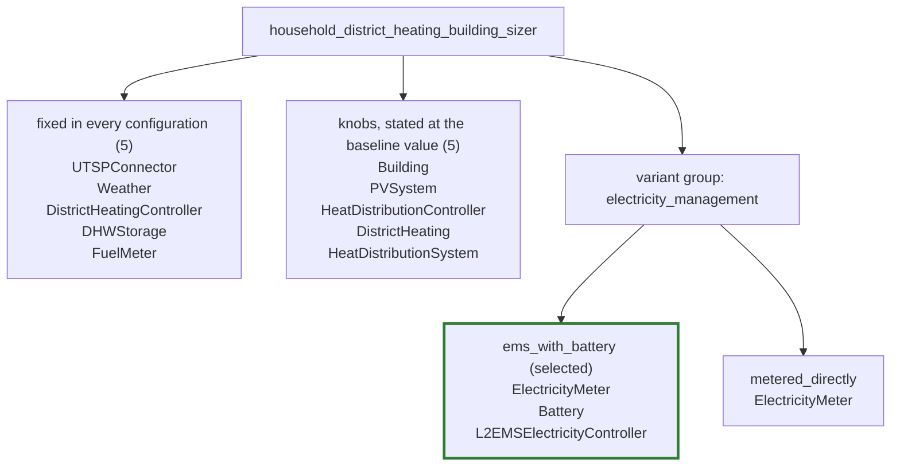

`ElectricityMeter` appears under both options because it is assigned to the group rather than to one option: it is present in every configuration, and each option writes it out in full with its own wiring. The first two boxes together are the grouped file's shared `components:` section — ten components, of which the five knobs are the ones whose committed value a consumer replaces — and each option box is that option's own `components:` block, so every component of the setup is on this picture exactly where the grouped file puts it.

### Assignments

| Component | Assignment | Judgement |
| --- | --- | --- |
| `ElectricityMeter` | `variant:electricity_management` | Present in every configuration and wired differently: fed by the energy manager's grid balance when there is one, and by every participant directly when there is not. A group can add and remove a component but cannot rewire one that survives, so this is the row that forces a variant. Written out in full in both options. |
| `Battery` | `variant:electricity_management/ems_with_battery` | Exists only in the world that has an energy manager; the setup builds the two together and there is no battery-without-manager mode. Its capacity also follows the rooftop share, which stays a knob on top of the membership. |
| `L2EMSElectricityController` | `variant:electricity_management/ems_with_battery` | The other half of that world, and the component the meter's two wirings are about. |
| `Building` | `override` | Only the TABULA code moves. The envelope behind it - the U-values, the areas, the heat capacity class - is looked up by the component itself and never written into the file, so one archetype instead of another is a value a consumer picks and the component and its wiring are the same either way. |
| `PVSystem` | `override` | Only the installed peak power moves, and only with the rooftop share. Nothing appears or disappears, so this is a number a consumer picks, not a part of the household. A share of zero is refused when the setup is built, so the knob's range is (0, 1] and no value it can take flips the household into another variant. |
| `HeatDistributionController` | `override` | Radiators change the flow temperature curve this controller is built from. Same component, same wiring, different numbers - a knob, not a switch. |
| `DistrictHeating` | `override` | The delivered thermal power is the building's heating load, so a better insulated envelope buys a smaller connection. Same station, same wiring, a different rating - and its controller is not in this table at all, because the station's power band reaches the controller nowhere. |
| `HeatDistributionSystem` | `override` | Radiator or floor heating is one enum plus the water mass flow rate derived from it; the emitter area comes from the building's conditioned floor area and does not move with the emitter type. The emitter is present either way. |

Ordering rule: variant assignments first, then overrides. Within the variant assignments, groups in the order the grouped file's `variants:` section lists them; within a group, the members assigned to the group as a whole before the members assigned to a single option, then the options in the order that section lists them, and within each option the order that option's `components:` block lists them. Within the overrides, the order the shared `components:` section lists them. The judgement text is the note from the grouping table in full, with the YAML line wrapping undone.

### Probe configurations

| Probe column | What it varies | `electricity_management` | Gist |
| --- | --- | --- | --- |
| `baseline` | class defaults | `ems_with_battery` | The class defaults, recorded with no module configuration at all, which is what makes this column's flat file the committed twin: full rooftop photovoltaics, battery and energy manager on, floor heating, and the district heating connection this file's family is named for. |
| `no_battery_ems` | `energy_system_config_.use_battery_and_ems = false` | `metered_directly` | The one structural fork this setup has. |
| `half_pv` | `energy_system_config_.share_of_maximum_pv_potential = 0.5` | `ems_with_battery` | Half the rooftop potential. |
| `radiator` | `energy_system_config_.heat_distribution_system = Conventional Radiator` | `ems_with_battery` | Radiators instead of floor heating. |
| `nineties_building` | `archetype_config_.building_code = DE.N.SFH.09.Gen.ReEx.001.002` | `ems_with_battery` | A 1995-2001 single-family house instead of a 1958-1968 one: the same TABULA archetype, one construction-year band later. |

The `What it varies` column is the probe's `module_config` overlay, one `field = value` per line; the baseline column has no overlay at all, which is what "class defaults" means. The `Gist` column is the first sentence of the probe's description; the full description stays in the probe list. Columns are in the order the probe list declares them.

## `household_electric_heating_building_sizer`

Recorded from `system_setups/household_electric_heating_building_sizer.py`, described in the grouped file as "Household electric heating system setup with building sizing." 7 components are shared by every configuration, and one variant group, `electricity_management`, chooses between `ems_with_battery` and `metered_directly`. Four of the shared components are overrides, which means the grouped file states the baseline's value for them and a consumer sets that value to something else.

### Shape

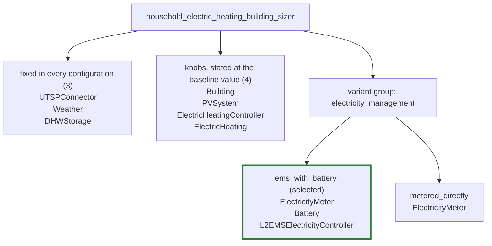

`ElectricityMeter` appears under both options because it is assigned to the group rather than to one option: it is present in every configuration, and each option writes it out in full with its own wiring. The first two boxes together are the grouped file's shared `components:` section — seven components, of which the four knobs are the ones whose committed value a consumer replaces — and each option box is that option's own `components:` block, so every component of the setup is on this picture exactly where the grouped file puts it.

### Assignments

| Component | Assignment | Judgement |
| --- | --- | --- |
| `ElectricityMeter` | `variant:electricity_management` | Present in every configuration and wired differently: fed by the energy manager's grid balance when there is one, and by every participant directly when there is not. A group can add and remove a component but cannot rewire one that survives, so this is the row that forces a variant. Written out in full in both options. |
| `Battery` | `variant:electricity_management/ems_with_battery` | Exists only in the world that has an energy manager; the setup builds the two together and there is no battery-without-manager mode. Its capacity also follows the rooftop share, which stays a knob on top of the membership. |
| `L2EMSElectricityController` | `variant:electricity_management/ems_with_battery` | The other half of that world, and the component the meter's two wirings are about. |
| `Building` | `override` | Only the TABULA code moves. The envelope behind it - the U-values, the areas, the heat capacity class - is looked up by the component itself and never written into the file, so one archetype instead of another is a value a consumer picks and the component and its wiring are the same either way. |
| `PVSystem` | `override` | Only the installed peak power moves, and only with the rooftop share. Nothing appears or disappears, so this is a number a consumer picks, not a part of the household. A share of zero is refused when the setup is built, so the knob's range is (0, 1] and no value it can take flips the household into another variant. |
| `ElectricHeatingController` | `override` | Built from the heater's own power band, so it follows the generator one step further down the same cascade. |
| `ElectricHeating` | `override` | The installed electric power is the building's heating load, so a better insulated envelope buys a smaller heater. Same heater, same wiring, a different rating. This setup has no heat-distribution axis - the heater warms the building directly and there is no emitter or emitter controller to move - so the archetype column is the only one that touches it. |

Ordering rule: variant assignments first, then overrides. Within the variant assignments, groups in the order the grouped file's `variants:` section lists them; within a group, the members assigned to the group as a whole before the members assigned to a single option, then the options in the order that section lists them, and within each option the order that option's `components:` block lists them. Within the overrides, the order the shared `components:` section lists them. The judgement text is the note from the grouping table in full, with the YAML line wrapping undone.

### Probe configurations

| Probe column | What it varies | `electricity_management` | Gist |
| --- | --- | --- | --- |
| `baseline` | class defaults | `ems_with_battery` | The class defaults, recorded with no module configuration at all, which is what makes this column's flat file the committed twin: full rooftop photovoltaics, battery and energy manager on, and the direct electric heater this file's family is named for. |
| `no_battery_ems` | `energy_system_config_.use_battery_and_ems = false` | `metered_directly` | The one structural fork this setup has. |
| `half_pv` | `energy_system_config_.share_of_maximum_pv_potential = 0.5` | `ems_with_battery` | Half the rooftop potential. |
| `nineties_building` | `archetype_config_.building_code = DE.N.SFH.09.Gen.ReEx.001.002` | `ems_with_battery` | A 1995-2001 single-family house instead of a 1958-1968 one: the same TABULA archetype, one construction-year band later. |

The `What it varies` column is the probe's `module_config` overlay, one `field = value` per line; the baseline column has no overlay at all, which is what "class defaults" means. The `Gist` column is the first sentence of the probe's description; the full description stays in the probe list. Columns are in the order the probe list declares them.

## `household_gas_building_sizer`

Recorded from `system_setups/household_gas_building_sizer.py`, described in the grouped file as "Basic household new system setup." 11 components are shared by every configuration, and one variant group, `electricity_management`, chooses between `ems_with_battery` and `metered_directly`. Seven of the shared components are overrides, which means the grouped file states the baseline's value for them and a consumer sets that value to something else.

### Shape

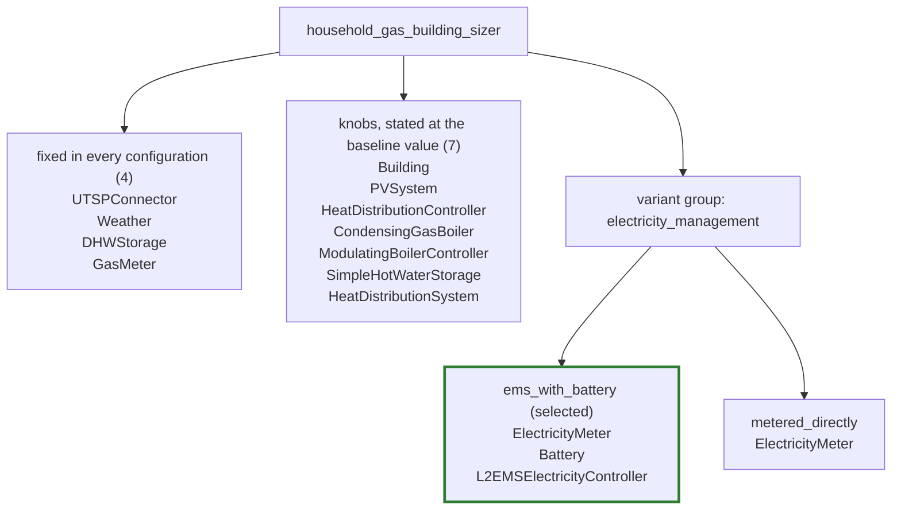

`ElectricityMeter` appears under both options because it is assigned to the group rather than to one option: it is present in every configuration, and each option writes it out in full with its own wiring. The first two boxes together are the grouped file's shared `components:` section — eleven components, of which the seven knobs are the ones whose committed value a consumer replaces — and each option box is that option's own `components:` block, so every component of the setup is on this picture exactly where the grouped file puts it.

### Assignments

| Component | Assignment | Judgement |
| --- | --- | --- |
| `ElectricityMeter` | `variant:electricity_management` | Present in every configuration and wired differently: fed by the energy manager's grid balance when there is one, and by every participant directly when there is not. A group can add and remove a component but cannot rewire one that survives, so this is the row that forces a variant. Written out in full in both options. |
| `Battery` | `variant:electricity_management/ems_with_battery` | Exists only in the world that has an energy manager; the setup builds the two together and there is no battery-without-manager mode. Its capacity also follows the rooftop share, which stays a knob on top of the membership. |
| `L2EMSElectricityController` | `variant:electricity_management/ems_with_battery` | The other half of that world, and the component the meter's two wirings are about. |
| `Building` | `override` | Only the TABULA code moves. The envelope behind it - the U-values, the areas, the heat capacity class - is looked up by the component itself and never written into the file, so one archetype instead of another is a value a consumer picks and the component and its wiring are the same either way. |
| `PVSystem` | `override` | Only the installed peak power moves, and only with the rooftop share. Nothing appears or disappears, so this is a number a consumer picks, not a part of the household. A share of zero is refused when the setup is built, so the knob's range is (0, 1] and no value it can take flips the household into another variant. |
| `HeatDistributionController` | `override` | Radiators change the flow temperature curve this controller is built from. Same component, same wiring, different numbers - a knob, not a switch. |
| `CondensingGasBoiler` | `override` | Its thermal power band is the building's heating load, so a better insulated envelope buys a smaller boiler. Same boiler, same wiring, a different rating - the gas generator's counterpart of the heat pump's set thermal output power. |
| `ModulatingBoilerController` | `override` | Built from the boiler's own minimal and maximal thermal power, so it follows the generator one step further down the same cascade. It does not move with the emitter type, which is why only the archetype column disagrees with it. |
| `SimpleHotWaterStorage` | `override` | The buffer volume is scaled from the heating load under the gas-heater sizing rule, so it follows the same building demand one step further down. A number the building determines, not a component that comes or goes. |
| `HeatDistributionSystem` | `override` | Radiator or floor heating is one enum plus the water mass flow rate derived from it; the emitter area comes from the building's conditioned floor area and does not move with the emitter type. The emitter is present either way. |

Ordering rule: variant assignments first, then overrides. Within the variant assignments, groups in the order the grouped file's `variants:` section lists them; within a group, the members assigned to the group as a whole before the members assigned to a single option, then the options in the order that section lists them, and within each option the order that option's `components:` block lists them. Within the overrides, the order the shared `components:` section lists them. The judgement text is the note from the grouping table in full, with the YAML line wrapping undone.

### Probe configurations

| Probe column | What it varies | `electricity_management` | Gist |
| --- | --- | --- | --- |
| `baseline` | class defaults | `ems_with_battery` | The class defaults, recorded with no module configuration at all, which is what makes this column's flat file the committed twin: full rooftop photovoltaics, battery and energy manager on, floor heating, and the condensing gas boiler this file's family is named for. |
| `no_battery_ems` | `energy_system_config_.use_battery_and_ems = false` | `metered_directly` | The one structural fork this setup has. |
| `half_pv` | `energy_system_config_.share_of_maximum_pv_potential = 0.5` | `ems_with_battery` | Half the rooftop potential. |
| `radiator` | `energy_system_config_.heat_distribution_system = Conventional Radiator` | `ems_with_battery` | Radiators instead of floor heating. |
| `nineties_building` | `archetype_config_.building_code = DE.N.SFH.09.Gen.ReEx.001.002` | `ems_with_battery` | A 1995-2001 single-family house instead of a 1958-1968 one: the same TABULA archetype, one construction-year band later. |

The `What it varies` column is the probe's `module_config` overlay, one `field = value` per line; the baseline column has no overlay at all, which is what "class defaults" means. The `Gist` column is the first sentence of the probe's description; the full description stays in the probe list. Columns are in the order the probe list declares them.

## `household_gas_solar_thermal`

Recorded from `system_setups/household_gas_solar_thermal.py`, described in the grouped file as "Household setup with gas boiler and solar thermal system for DHW." 13 components are shared by every configuration, and the grouped file declares no variant group. Two of the shared components are overrides, which means the grouped file states the baseline's value for them and a consumer sets that value to something else.

### Shape

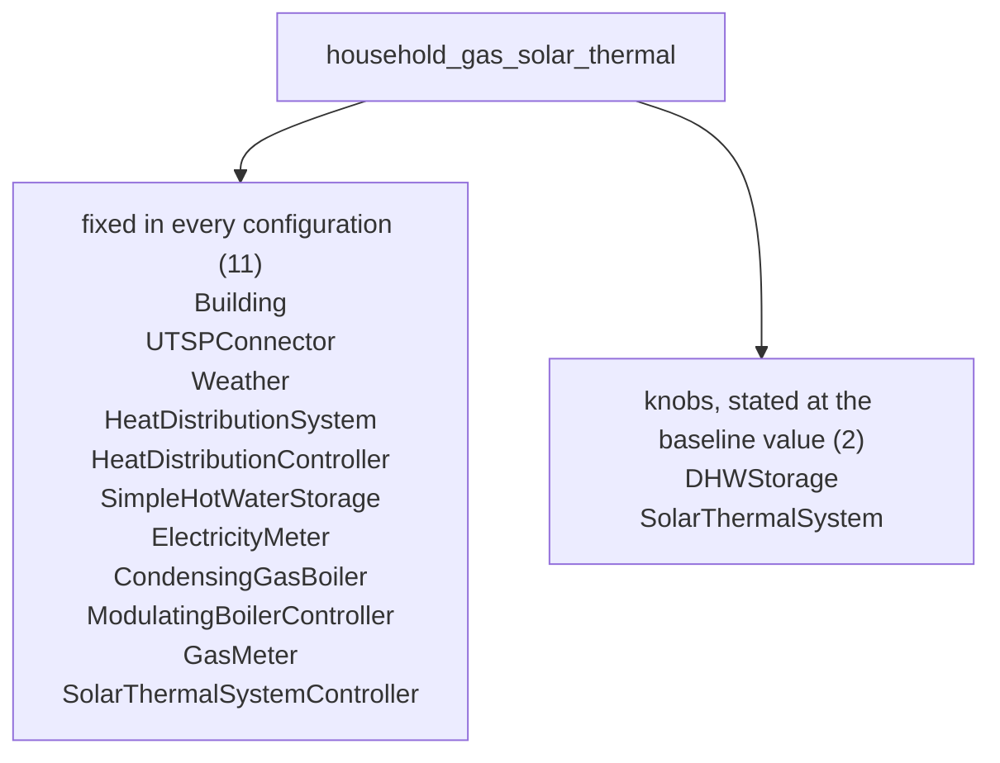

The first two boxes together are the grouped file's shared `components:` section — 13 components, of which the two knobs are the ones whose committed value a consumer replaces — and the setup has no variant group, so that is every component it has.

### Assignments

| Component | Assignment | Judgement |
| --- | --- | --- |
| `DHWStorage` | `override` | The storage volume and its heat loss are scaled per dwelling, so the one field this setup reads out of its module configuration lands here. Same storage, same wiring, a different size - a number a consumer picks. |
| `SolarThermalSystem` | `override` | Four square metres of collector per dwelling, so the same field reaches the collector as reaches the storage it preheats. Same collector, same wiring, a larger array - a number a consumer picks, not a component that comes or goes. |

Ordering rule: variant assignments first, then overrides. Within the variant assignments, groups in the order the grouped file's `variants:` section lists them; within a group, the members assigned to the group as a whole before the members assigned to a single option, then the options in the order that section lists them, and within each option the order that option's `components:` block lists them. Within the overrides, the order the shared `components:` section lists them. The judgement text is the note from the grouping table in full, with the YAML line wrapping undone.

### Probe configurations

| Probe column | What it varies | Gist |
| --- | --- | --- |
| `baseline` | class defaults | The class defaults, recorded with no module configuration at all, which is what makes this column's flat file the committed twin: one dwelling, the condensing gas boiler and the solar thermal collector that preheats its domestic hot water. |
| `two_dwellings` | `archetype_config_.number_of_dwellings_per_building = 2` | Two dwellings instead of one. |

The `What it varies` column is the probe's `module_config` overlay, one `field = value` per line; the baseline column has no overlay at all, which is what "class defaults" means. The `Gist` column is the first sentence of the probe's description; the full description stays in the probe list. Columns are in the order the probe list declares them.

## `household_gas_solar_thermal_building_sizer`

Recorded from `system_setups/household_gas_solar_thermal_building_sizer.py`, described in the grouped file as "Basic household system setup. Shows how to set up a standard system." 13 components are shared by every configuration, and one variant group, `electricity_management`, chooses between `ems_with_battery` and `metered_directly`. Seven of the shared components are overrides, which means the grouped file states the baseline's value for them and a consumer sets that value to something else.

### Shape

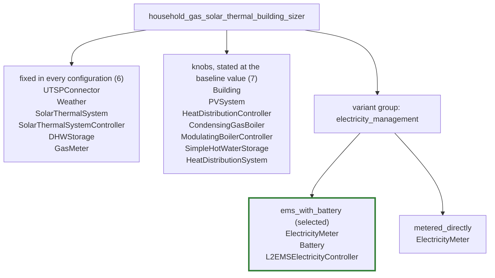

`ElectricityMeter` appears under both options because it is assigned to the group rather than to one option: it is present in every configuration, and each option writes it out in full with its own wiring. The first two boxes together are the grouped file's shared `components:` section — 13 components, of which the seven knobs are the ones whose committed value a consumer replaces — and each option box is that option's own `components:` block, so every component of the setup is on this picture exactly where the grouped file puts it.

### Assignments

| Component | Assignment | Judgement |
| --- | --- | --- |
| `ElectricityMeter` | `variant:electricity_management` | Present in every configuration and wired differently: fed by the energy manager's grid balance when there is one, and by every participant directly when there is not. A group can add and remove a component but cannot rewire one that survives, so this is the row that forces a variant. Written out in full in both options. |
| `Battery` | `variant:electricity_management/ems_with_battery` | Exists only in the world that has an energy manager; the setup builds the two together and there is no battery-without-manager mode. Its capacity also follows the rooftop share, which stays a knob on top of the membership. |
| `L2EMSElectricityController` | `variant:electricity_management/ems_with_battery` | The other half of that world, and the component the meter's two wirings are about. |
| `Building` | `override` | Only the TABULA code moves. The envelope behind it - the U-values, the areas, the heat capacity class - is looked up by the component itself and never written into the file, so one archetype instead of another is a value a consumer picks and the component and its wiring are the same either way. |
| `PVSystem` | `override` | Only the installed peak power moves, and only with the rooftop share. Nothing appears or disappears, so this is a number a consumer picks, not a part of the household. A share of zero is refused when the setup is built, so the knob's range is (0, 1] and no value it can take flips the household into another variant. The solar thermal collector's area is not on this axis: it is four square metres per dwelling and the rooftop share never reaches it. |
| `HeatDistributionController` | `override` | Radiators change the flow temperature curve this controller is built from. Same component, same wiring, different numbers - a knob, not a switch. |
| `CondensingGasBoiler` | `override` | Its thermal power band is the building's heating load, so a better insulated envelope buys a smaller gas boiler. Same boiler, same wiring, a different rating - the generator's counterpart of the heat pump's set thermal output power. |
| `ModulatingBoilerController` | `override` | Built from the boiler's own minimal and maximal thermal power, so it follows the generator one step further down the same cascade. It does not move with the emitter type, which is why only the archetype column disagrees with it. |
| `SimpleHotWaterStorage` | `override` | The buffer volume is scaled from the heating load under the boiler sizing rule, so it follows the same building demand one step further down. A number the building determines, not a component that comes or goes. |
| `HeatDistributionSystem` | `override` | Radiator or floor heating is one enum plus the water mass flow rate derived from it; the emitter area comes from the building's conditioned floor area and does not move with the emitter type. The emitter is present either way. |

Ordering rule: variant assignments first, then overrides. Within the variant assignments, groups in the order the grouped file's `variants:` section lists them; within a group, the members assigned to the group as a whole before the members assigned to a single option, then the options in the order that section lists them, and within each option the order that option's `components:` block lists them. Within the overrides, the order the shared `components:` section lists them. The judgement text is the note from the grouping table in full, with the YAML line wrapping undone.

### Probe configurations

| Probe column | What it varies | `electricity_management` | Gist |
| --- | --- | --- | --- |
| `baseline` | class defaults | `ems_with_battery` | The class defaults, recorded with no module configuration at all, which is what makes this column's flat file the committed twin: full rooftop photovoltaics, battery and energy manager on, floor heating, and the condensing gas boiler beside the solar thermal collector that preheats the domestic hot water. |
| `no_battery_ems` | `energy_system_config_.use_battery_and_ems = false` | `metered_directly` | The one structural fork this setup has. |
| `half_pv` | `energy_system_config_.share_of_maximum_pv_potential = 0.5` | `ems_with_battery` | Half the rooftop potential. |
| `radiator` | `energy_system_config_.heat_distribution_system = Conventional Radiator` | `ems_with_battery` | Radiators instead of floor heating. |
| `nineties_building` | `archetype_config_.building_code = DE.N.SFH.09.Gen.ReEx.001.002` | `ems_with_battery` | A 1995-2001 single-family house instead of a 1958-1968 one: the same TABULA archetype, one construction-year band later. |

The `What it varies` column is the probe's `module_config` overlay, one `field = value` per line; the baseline column has no overlay at all, which is what "class defaults" means. The `Gist` column is the first sentence of the probe's description; the full description stays in the probe list. Columns are in the order the probe list declares them.

## `household_heatpump_building_sizer`

Recorded from `system_setups/household_heatpump_building_sizer.py`, described in the grouped file as "Basic household new system setup." 11 components are shared by every configuration, and one variant group, `electricity_management`, chooses between `ems_with_battery` and `metered_directly`. Seven of the shared components are overrides, which means the grouped file states the baseline's value for them and a consumer sets that value to something else.

### Shape

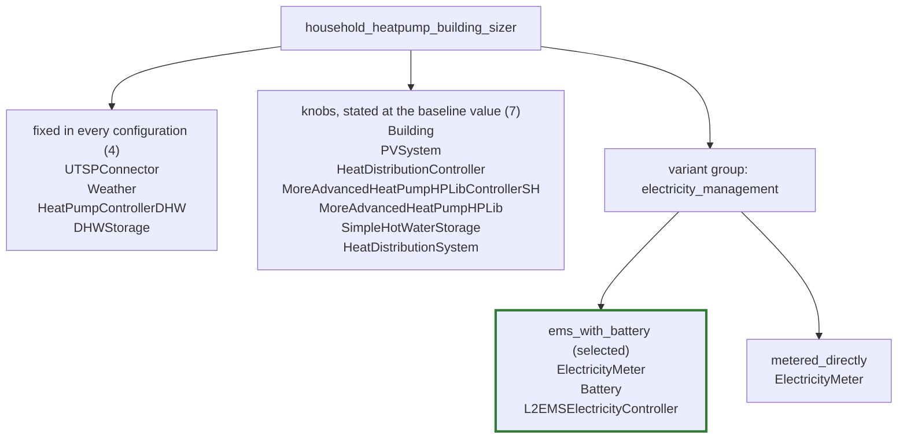

`ElectricityMeter` appears under both options because it is assigned to the group rather than to one option: it is present in every configuration, and each option writes it out in full with its own wiring. The first two boxes together are the grouped file's shared `components:` section — eleven components, of which the seven knobs are the ones whose committed value a consumer replaces — and each option box is that option's own `components:` block, so every component of the setup is on this picture exactly where the grouped file puts it.

### Assignments

| Component | Assignment | Judgement |
| --- | --- | --- |
| `ElectricityMeter` | `variant:electricity_management` | Present in every configuration and wired differently: fed by the energy manager's grid balance when there is one, and by every participant directly when there is not. A group can add and remove a component but cannot rewire one that survives, so this is the row that forces a variant. Written out in full in both options. |
| `Battery` | `variant:electricity_management/ems_with_battery` | Exists only in the world that has an energy manager; the setup builds the two together and there is no battery-without-manager mode. Its capacity also follows the rooftop share, which stays a knob on top of the membership. |
| `L2EMSElectricityController` | `variant:electricity_management/ems_with_battery` | The other half of that world, and the component the meter's two wirings are about. |
| `Building` | `override` | Only the TABULA code moves. The envelope behind it - the U-values, the areas, the heat capacity class - is looked up by the component itself and never written into the file, so one archetype instead of another is a value a consumer picks and the component and its wiring are the same either way. |
| `PVSystem` | `override` | Only the installed peak power moves, and only with the rooftop share. Nothing appears or disappears, so this is a number a consumer picks, not a part of the household. A share of zero is refused when the setup is built, so the knob's range is (0, 1] and no value it can take flips the household into another variant. |
| `HeatDistributionController` | `override` | Radiators change the flow temperature curve this controller is built from. Same component, same wiring, different numbers - a knob, not a switch. |
| `MoreAdvancedHeatPumpHPLibControllerSH` | `override` | Follows the distribution system's temperatures for the same reason as the controller above. |
| `MoreAdvancedHeatPumpHPLib` | `override` | Its set thermal output power is the building's heating load, so a better insulated envelope buys a smaller pump. Same pump, same wiring, a different rating. |
| `SimpleHotWaterStorage` | `override` | The buffer volume is fifty litres per kilowatt of heat pump output, so it follows the same heating load one step further down. A number the building determines, not a component that comes or goes. |
| `HeatDistributionSystem` | `override` | Radiator or floor heating is one enum plus the water mass flow rate derived from it; the emitter area comes from the building's conditioned floor area and does not move with the emitter type. The emitter is present either way. |

Ordering rule: variant assignments first, then overrides. Within the variant assignments, groups in the order the grouped file's `variants:` section lists them; within a group, the members assigned to the group as a whole before the members assigned to a single option, then the options in the order that section lists them, and within each option the order that option's `components:` block lists them. Within the overrides, the order the shared `components:` section lists them. The judgement text is the note from the grouping table in full, with the YAML line wrapping undone.

### Probe configurations

| Probe column | What it varies | `electricity_management` | Gist |
| --- | --- | --- | --- |
| `baseline` | class defaults | `ems_with_battery` | The class defaults, recorded with no module configuration at all, which is what makes this column's flat file the committed twin: full rooftop photovoltaics, battery and energy manager on, floor heating. |
| `no_battery_ems` | `energy_system_config_.use_battery_and_ems = false` | `metered_directly` | The one structural fork this setup has. |
| `half_pv` | `energy_system_config_.share_of_maximum_pv_potential = 0.5` | `ems_with_battery` | Half the rooftop potential. |
| `radiator` | `energy_system_config_.heat_distribution_system = Conventional Radiator` | `ems_with_battery` | Radiators instead of floor heating. |
| `nineties_building` | `archetype_config_.building_code = DE.N.SFH.09.Gen.ReEx.001.002` | `ems_with_battery` | A 1995-2001 single-family house instead of a 1958-1968 one: the same TABULA archetype, one construction-year band later. |

The `What it varies` column is the probe's `module_config` overlay, one `field = value` per line; the baseline column has no overlay at all, which is what "class defaults" means. The `Gist` column is the first sentence of the probe's description; the full description stays in the probe list. Columns are in the order the probe list declares them.

## `household_heatpump_car_building_sizer`

Recorded from `system_setups/household_heatpump_car_building_sizer.py`, described in the grouped file as "Basic household new system setup." 14 components are shared by every configuration, and one variant group, `electricity_management`, chooses between `ems_with_battery` and `metered_directly`. Seven of the shared components are overrides, which means the grouped file states the baseline's value for them and a consumer sets that value to something else.

### Shape

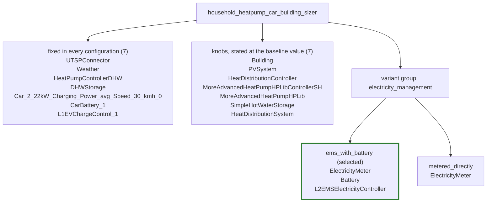

`ElectricityMeter` appears under both options because it is assigned to the group rather than to one option: it is present in every configuration, and each option writes it out in full with its own wiring. The first two boxes together are the grouped file's shared `components:` section — 14 components, of which the seven knobs are the ones whose committed value a consumer replaces — and each option box is that option's own `components:` block, so every component of the setup is on this picture exactly where the grouped file puts it.

### Assignments

| Component | Assignment | Judgement |
| --- | --- | --- |
| `ElectricityMeter` | `variant:electricity_management` | Present in every configuration and wired differently: fed by the energy manager's grid balance when there is one, and by every participant directly when there is not - the car controller included, as an uncontrolled consumption. A group can add and remove a component but cannot rewire one that survives, so this is the row that forces a variant. Written out in full in both options. |
| `Battery` | `variant:electricity_management/ems_with_battery` | Exists only in the world that has an energy manager; the setup builds the two together and there is no battery-without-manager mode. Its capacity also follows the rooftop share, which stays a knob on top of the membership. This is the stationary battery, not the car's. |
| `L2EMSElectricityController` | `variant:electricity_management/ems_with_battery` | The other half of that world, and the component the meter's two wirings are about. The car controller's charging power is one of the inputs that moves with it: the manager takes it as a controlled consumption here and the meter takes it as an uncontrolled one in the other option, so the car triple itself is identical in both and the whole difference is written on this row and the meter's. |
| `Building` | `override` | Only the TABULA code moves. The envelope behind it - the U-values, the areas, the heat capacity class - is looked up by the component itself and never written into the file, so one archetype instead of another is a value a consumer picks and the component and its wiring are the same either way. |
| `PVSystem` | `override` | Only the installed peak power moves, and only with the rooftop share. Nothing appears or disappears, so this is a number a consumer picks, not a part of the household. A share of zero is refused when the setup is built, so the knob's range is (0, 1] and no value it can take flips the household into another variant. The car battery is not on this axis: its capacity is the car's, not the roof's. |
| `HeatDistributionController` | `override` | Radiators change the flow temperature curve this controller is built from. Same component, same wiring, different numbers - a knob, not a switch. |
| `MoreAdvancedHeatPumpHPLibControllerSH` | `override` | Follows the distribution system's temperatures for the same reason as the controller above. |
| `MoreAdvancedHeatPumpHPLib` | `override` | Its set thermal output power is the building's heating load, so a better insulated envelope buys a smaller pump. Same pump, same wiring, a different rating. Which side of the hplib Group fork its primary temperature input is wired on is decided by the shipped database and not by any column here, so that wiring is identical in all five. |
| `SimpleHotWaterStorage` | `override` | The buffer volume is fifty litres per kilowatt of heat pump output, so it follows the same heating load one step further down. A number the building determines, not a component that comes or goes. |
| `HeatDistributionSystem` | `override` | Radiator or floor heating is one enum plus the water mass flow rate derived from it; the emitter area comes from the building's conditioned floor area and does not move with the emitter type. The emitter is present either way. |

Ordering rule: variant assignments first, then overrides. Within the variant assignments, groups in the order the grouped file's `variants:` section lists them; within a group, the members assigned to the group as a whole before the members assigned to a single option, then the options in the order that section lists them, and within each option the order that option's `components:` block lists them. Within the overrides, the order the shared `components:` section lists them. The judgement text is the note from the grouping table in full, with the YAML line wrapping undone.

### Probe configurations

| Probe column | What it varies | `electricity_management` | Gist |
| --- | --- | --- | --- |
| `baseline` | class defaults | `ems_with_battery` | The class defaults, recorded with no module configuration at all, which is what makes this column's flat file the committed twin: full rooftop photovoltaics, battery and energy manager on, floor heating, and the one car the recorded household drives. |
| `no_battery_ems` | `energy_system_config_.use_battery_and_ems = false` | `metered_directly` | The one structural fork configuration can reach. |
| `half_pv` | `energy_system_config_.share_of_maximum_pv_potential = 0.5` | `ems_with_battery` | Half the rooftop potential. |
| `radiator` | `energy_system_config_.heat_distribution_system = Conventional Radiator` | `ems_with_battery` | Radiators instead of floor heating. |
| `nineties_building` | `archetype_config_.building_code = DE.N.SFH.09.Gen.ReEx.001.002` | `ems_with_battery` | A 1995-2001 single-family house instead of a 1958-1968 one: the same TABULA archetype, one construction-year band later. |

The `What it varies` column is the probe's `module_config` overlay, one `field = value` per line; the baseline column has no overlay at all, which is what "class defaults" means. The `Gist` column is the first sentence of the probe's description; the full description stays in the probe list. Columns are in the order the probe list declares them.

## `household_heatpump_solar_thermal_building_sizer`

Recorded from `system_setups/household_heatpump_solar_thermal_building_sizer.py`, described in the grouped file as "Basic household system setup. Shows how to set up a standard system." 13 components are shared by every configuration, and one variant group, `electricity_management`, chooses between `ems_with_battery` and `metered_directly`. Seven of the shared components are overrides, which means the grouped file states the baseline's value for them and a consumer sets that value to something else.

### Shape

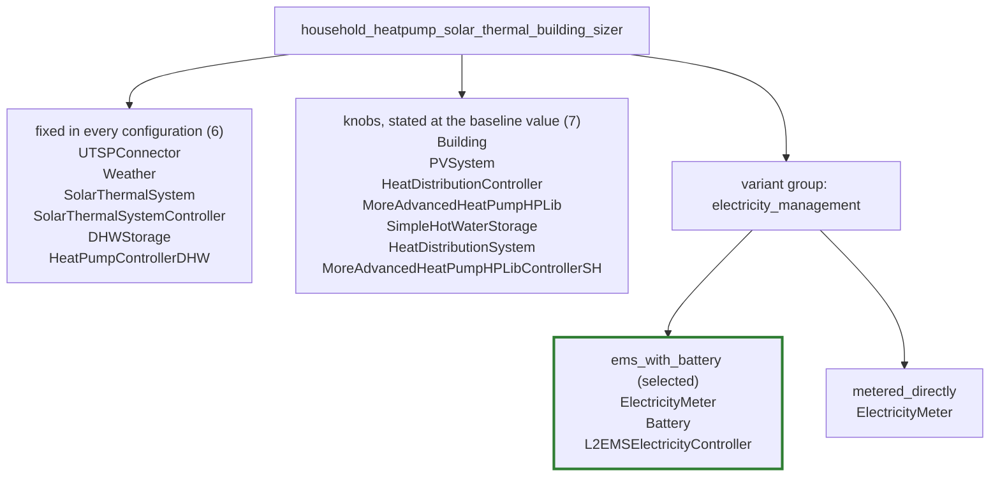

`ElectricityMeter` appears under both options because it is assigned to the group rather than to one option: it is present in every configuration, and each option writes it out in full with its own wiring. The first two boxes together are the grouped file's shared `components:` section — 13 components, of which the seven knobs are the ones whose committed value a consumer replaces — and each option box is that option's own `components:` block, so every component of the setup is on this picture exactly where the grouped file puts it.

### Assignments

| Component | Assignment | Judgement |
| --- | --- | --- |
| `ElectricityMeter` | `variant:electricity_management` | Present in every configuration and wired differently: fed by the energy manager's grid balance when there is one, and by every participant directly when there is not. A group can add and remove a component but cannot rewire one that survives, so this is the row that forces a variant. Written out in full in both options. |
| `Battery` | `variant:electricity_management/ems_with_battery` | Exists only in the world that has an energy manager; the setup builds the two together and there is no battery-without-manager mode. Its capacity also follows the rooftop share, which stays a knob on top of the membership. |
| `L2EMSElectricityController` | `variant:electricity_management/ems_with_battery` | The other half of that world, and the component the meter's two wirings are about. |
| `Building` | `override` | Only the TABULA code moves. The envelope behind it - the U-values, the areas, the heat capacity class - is looked up by the component itself and never written into the file, so one archetype instead of another is a value a consumer picks and the component and its wiring are the same either way. |
| `PVSystem` | `override` | Only the installed peak power moves, and only with the rooftop share. Nothing appears or disappears, so this is a number a consumer picks, not a part of the household. A share of zero is refused when the setup is built, so the knob's range is (0, 1] and no value it can take flips the household into another variant. The solar thermal collector's area is not on this axis: it is four square metres per dwelling and the rooftop share never reaches it. |
| `HeatDistributionController` | `override` | Radiators change the flow temperature curve this controller is built from. Same component, same wiring, different numbers - a knob, not a switch. |
| `MoreAdvancedHeatPumpHPLib` | `override` | Its set thermal output power is the building's heating load, so a better insulated envelope buys a smaller pump. Same pump, same wiring, a different rating. Which side of the hplib Group fork the pump's primary temperature input is wired on is decided by the shipped database and not by any column here, so that wiring is identical in all five and is not part of this judgement. |
| `SimpleHotWaterStorage` | `override` | The buffer volume is fifty litres per kilowatt of heat pump output, so it follows the same heating load one step further down. A number the building determines, not a component that comes or goes. |
| `HeatDistributionSystem` | `override` | Radiator or floor heating is one enum plus the water mass flow rate derived from it; the emitter area comes from the building's conditioned floor area and does not move with the emitter type. The emitter is present either way. |
| `MoreAdvancedHeatPumpHPLibControllerSH` | `override` | Follows the distribution system's temperatures for the same reason as the distribution controller above, which is why the emitter column is the only one that disagrees with it. |

Ordering rule: variant assignments first, then overrides. Within the variant assignments, groups in the order the grouped file's `variants:` section lists them; within a group, the members assigned to the group as a whole before the members assigned to a single option, then the options in the order that section lists them, and within each option the order that option's `components:` block lists them. Within the overrides, the order the shared `components:` section lists them. The judgement text is the note from the grouping table in full, with the YAML line wrapping undone.

### Probe configurations

| Probe column | What it varies | `electricity_management` | Gist |
| --- | --- | --- | --- |
| `baseline` | class defaults | `ems_with_battery` | The class defaults, recorded with no module configuration at all, which is what makes this column's flat file the committed twin: full rooftop photovoltaics, battery and energy manager on, floor heating, and the heat pump beside the solar thermal collector that preheats the domestic hot water. |
| `no_battery_ems` | `energy_system_config_.use_battery_and_ems = false` | `metered_directly` | The one structural fork configuration can reach. |
| `half_pv` | `energy_system_config_.share_of_maximum_pv_potential = 0.5` | `ems_with_battery` | Half the rooftop potential. |
| `radiator` | `energy_system_config_.heat_distribution_system = Conventional Radiator` | `ems_with_battery` | Radiators instead of floor heating. |
| `nineties_building` | `archetype_config_.building_code = DE.N.SFH.09.Gen.ReEx.001.002` | `ems_with_battery` | A 1995-2001 single-family house instead of a 1958-1968 one: the same TABULA archetype, one construction-year band later. |

The `What it varies` column is the probe's `module_config` overlay, one `field = value` per line; the baseline column has no overlay at all, which is what "class defaults" means. The `Gist` column is the first sentence of the probe's description; the full description stays in the probe list. Columns are in the order the probe list declares them.

## `household_hydrogen_boiler_building_sizer`

Recorded from `system_setups/household_hydrogen_boiler_building_sizer.py`, described in the grouped file as "Basic household new system setup." 11 components are shared by every configuration, and one variant group, `electricity_management`, chooses between `ems_with_battery` and `metered_directly`. Seven of the shared components are overrides, which means the grouped file states the baseline's value for them and a consumer sets that value to something else.

### Shape

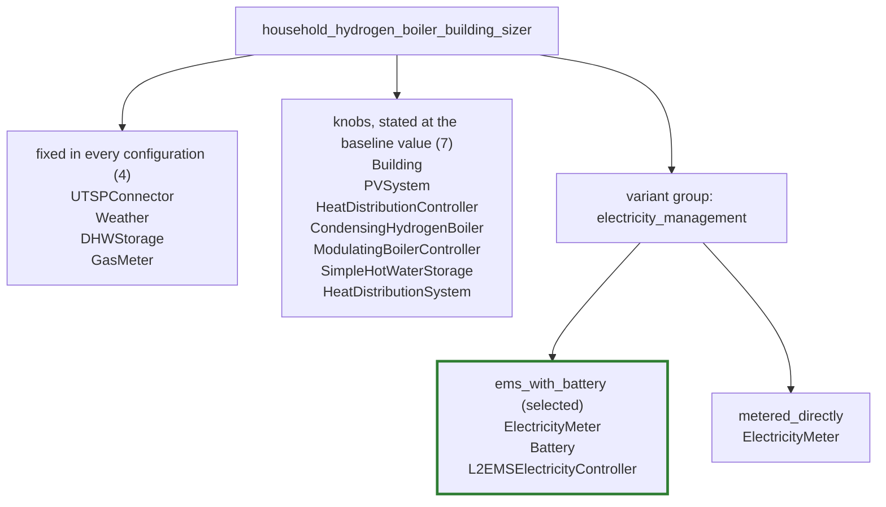

`ElectricityMeter` appears under both options because it is assigned to the group rather than to one option: it is present in every configuration, and each option writes it out in full with its own wiring. The first two boxes together are the grouped file's shared `components:` section — eleven components, of which the seven knobs are the ones whose committed value a consumer replaces — and each option box is that option's own `components:` block, so every component of the setup is on this picture exactly where the grouped file puts it.

### Assignments

| Component | Assignment | Judgement |
| --- | --- | --- |
| `ElectricityMeter` | `variant:electricity_management` | Present in every configuration and wired differently: fed by the energy manager's grid balance when there is one, and by every participant directly when there is not. A group can add and remove a component but cannot rewire one that survives, so this is the row that forces a variant. Written out in full in both options. |
| `Battery` | `variant:electricity_management/ems_with_battery` | Exists only in the world that has an energy manager; the setup builds the two together and there is no battery-without-manager mode. Its capacity also follows the rooftop share, which stays a knob on top of the membership. |
| `L2EMSElectricityController` | `variant:electricity_management/ems_with_battery` | The other half of that world, and the component the meter's two wirings are about. |
| `Building` | `override` | Only the TABULA code moves. The envelope behind it - the U-values, the areas, the heat capacity class - is looked up by the component itself and never written into the file, so one archetype instead of another is a value a consumer picks and the component and its wiring are the same either way. |
| `PVSystem` | `override` | Only the installed peak power moves, and only with the rooftop share. Nothing appears or disappears, so this is a number a consumer picks, not a part of the household. A share of zero is refused when the setup is built, so the knob's range is (0, 1] and no value it can take flips the household into another variant. |
| `HeatDistributionController` | `override` | Radiators change the flow temperature curve this controller is built from. Same component, same wiring, different numbers - a knob, not a switch. |
| `CondensingHydrogenBoiler` | `override` | Its thermal power band is the building's heating load, so a better insulated envelope buys a smaller hydrogen boiler. Same boiler, same wiring, a different rating - the generator's counterpart of the heat pump's set thermal output power. |
| `ModulatingBoilerController` | `override` | Built from the boiler's own minimal and maximal thermal power, so it follows the generator one step further down the same cascade. It does not move with the emitter type, which is why only the archetype column disagrees with it. |
| `SimpleHotWaterStorage` | `override` | The buffer volume is scaled from the heating load under the boiler sizing rule, so it follows the same building demand one step further down. A number the building determines, not a component that comes or goes. |
| `HeatDistributionSystem` | `override` | Radiator or floor heating is one enum plus the water mass flow rate derived from it; the emitter area comes from the building's conditioned floor area and does not move with the emitter type. The emitter is present either way. |

Ordering rule: variant assignments first, then overrides. Within the variant assignments, groups in the order the grouped file's `variants:` section lists them; within a group, the members assigned to the group as a whole before the members assigned to a single option, then the options in the order that section lists them, and within each option the order that option's `components:` block lists them. Within the overrides, the order the shared `components:` section lists them. The judgement text is the note from the grouping table in full, with the YAML line wrapping undone.

### Probe configurations

| Probe column | What it varies | `electricity_management` | Gist |
| --- | --- | --- | --- |
| `baseline` | class defaults | `ems_with_battery` | The class defaults, recorded with no module configuration at all, which is what makes this column's flat file the committed twin: full rooftop photovoltaics, battery and energy manager on, floor heating, and the condensing hydrogen boiler this file's family is named for. |
| `no_battery_ems` | `energy_system_config_.use_battery_and_ems = false` | `metered_directly` | The one structural fork this setup has. |
| `half_pv` | `energy_system_config_.share_of_maximum_pv_potential = 0.5` | `ems_with_battery` | Half the rooftop potential. |
| `radiator` | `energy_system_config_.heat_distribution_system = Conventional Radiator` | `ems_with_battery` | Radiators instead of floor heating. |
| `nineties_building` | `archetype_config_.building_code = DE.N.SFH.09.Gen.ReEx.001.002` | `ems_with_battery` | A 1995-2001 single-family house instead of a 1958-1968 one: the same TABULA archetype, one construction-year band later. |

The `What it varies` column is the probe's `module_config` overlay, one `field = value` per line; the baseline column has no overlay at all, which is what "class defaults" means. The `Gist` column is the first sentence of the probe's description; the full description stays in the probe list. Columns are in the order the probe list declares them.

## `household_oil_building_sizer`

Recorded from `system_setups/household_oil_building_sizer.py`, described in the grouped file as "Household system setup with an oil-based heating system (building-sizer variant)." 11 components are shared by every configuration, and one variant group, `electricity_management`, chooses between `ems_with_battery` and `metered_directly`. Seven of the shared components are overrides, which means the grouped file states the baseline's value for them and a consumer sets that value to something else.

### Shape


`ElectricityMeter` appears under both options because it is assigned to the group rather than to one option: it is present in every configuration, and each option writes it out in full with its own wiring. The first two boxes together are the grouped file's shared `components:` section — eleven components, of which the seven knobs are the ones whose committed value a consumer replaces — and each option box is that option's own `components:` block, so every component of the setup is on this picture exactly where the grouped file puts it.

### Assignments

| Component | Assignment | Judgement |
| --- | --- | --- |
| `ElectricityMeter` | `variant:electricity_management` | Present in every configuration and wired differently: fed by the energy manager's grid balance when there is one, and by every participant directly when there is not. A group can add and remove a component but cannot rewire one that survives, so this is the row that forces a variant. Written out in full in both options. |
| `Battery` | `variant:electricity_management/ems_with_battery` | Exists only in the world that has an energy manager; the setup builds the two together and there is no battery-without-manager mode. Its capacity also follows the rooftop share, which stays a knob on top of the membership. |
| `L2EMSElectricityController` | `variant:electricity_management/ems_with_battery` | The other half of that world, and the component the meter's two wirings are about. |
| `Building` | `override` | Only the TABULA code moves. The envelope behind it - the U-values, the areas, the heat capacity class - is looked up by the component itself and never written into the file, so one archetype instead of another is a value a consumer picks and the component and its wiring are the same either way. |
| `PVSystem` | `override` | Only the installed peak power moves, and only with the rooftop share. Nothing appears or disappears, so this is a number a consumer picks, not a part of the household. A share of zero is refused when the setup is built, so the knob's range is (0, 1] and no value it can take flips the household into another variant. |
| `HeatDistributionController` | `override` | Radiators change the flow temperature curve this controller is built from. Same component, same wiring, different numbers - a knob, not a switch. |
| `ConventionalOilBoiler` | `override` | Its thermal power band is the building's heating load, so a better insulated envelope buys a smaller oil boiler. Same boiler, same wiring, a different rating - the generator's counterpart of the heat pump's set thermal output power. |
| `ModulatingBoilerController` | `override` | Built from the boiler's own minimal and maximal thermal power, so it follows the generator one step further down the same cascade. It does not move with the emitter type, which is why only the archetype column disagrees with it. |
| `SimpleHotWaterStorage` | `override` | The buffer volume is scaled from the heating load under the boiler sizing rule, so it follows the same building demand one step further down. A number the building determines, not a component that comes or goes. |
| `HeatDistributionSystem` | `override` | Radiator or floor heating is one enum plus the water mass flow rate derived from it; the emitter area comes from the building's conditioned floor area and does not move with the emitter type. The emitter is present either way. |

Ordering rule: variant assignments first, then overrides. Within the variant assignments, groups in the order the grouped file's `variants:` section lists them; within a group, the members assigned to the group as a whole before the members assigned to a single option, then the options in the order that section lists them, and within each option the order that option's `components:` block lists them. Within the overrides, the order the shared `components:` section lists them. The judgement text is the note from the grouping table in full, with the YAML line wrapping undone.

### Probe configurations

| Probe column | What it varies | `electricity_management` | Gist |
| --- | --- | --- | --- |
| `baseline` | class defaults | `ems_with_battery` | The class defaults, recorded with no module configuration at all, which is what makes this column's flat file the committed twin: full rooftop photovoltaics, battery and energy manager on, floor heating, and the conventional oil boiler this file's family is named for. |
| `no_battery_ems` | `energy_system_config_.use_battery_and_ems = false` | `metered_directly` | The one structural fork this setup has. |
| `half_pv` | `energy_system_config_.share_of_maximum_pv_potential = 0.5` | `ems_with_battery` | Half the rooftop potential. |
| `radiator` | `energy_system_config_.heat_distribution_system = Conventional Radiator` | `ems_with_battery` | Radiators instead of floor heating. |
| `nineties_building` | `archetype_config_.building_code = DE.N.SFH.09.Gen.ReEx.001.002` | `ems_with_battery` | A 1995-2001 single-family house instead of a 1958-1968 one: the same TABULA archetype, one construction-year band later. |

The `What it varies` column is the probe's `module_config` overlay, one `field = value` per line; the baseline column has no overlay at all, which is what "class defaults" means. The `Gist` column is the first sentence of the probe's description; the full description stays in the probe list. Columns are in the order the probe list declares them.

## `household_pellets_building_sizer`

Recorded from `system_setups/household_pellets_building_sizer.py`, described in the grouped file as "Basic household new system setup." 11 components are shared by every configuration, and one variant group, `electricity_management`, chooses between `ems_with_battery` and `metered_directly`. Seven of the shared components are overrides, which means the grouped file states the baseline's value for them and a consumer sets that value to something else.

### Shape


`ElectricityMeter` appears under both options because it is assigned to the group rather than to one option: it is present in every configuration, and each option writes it out in full with its own wiring. The first two boxes together are the grouped file's shared `components:` section — eleven components, of which the seven knobs are the ones whose committed value a consumer replaces — and each option box is that option's own `components:` block, so every component of the setup is on this picture exactly where the grouped file puts it.

### Assignments

| Component | Assignment | Judgement |
| --- | --- | --- |
| `ElectricityMeter` | `variant:electricity_management` | Present in every configuration and wired differently: fed by the energy manager's grid balance when there is one, and by every participant directly when there is not. A group can add and remove a component but cannot rewire one that survives, so this is the row that forces a variant. Written out in full in both options. |
| `Battery` | `variant:electricity_management/ems_with_battery` | Exists only in the world that has an energy manager; the setup builds the two together and there is no battery-without-manager mode. Its capacity also follows the rooftop share, which stays a knob on top of the membership. |
| `L2EMSElectricityController` | `variant:electricity_management/ems_with_battery` | The other half of that world, and the component the meter's two wirings are about. |
| `Building` | `override` | Only the TABULA code moves. The envelope behind it - the U-values, the areas, the heat capacity class - is looked up by the component itself and never written into the file, so one archetype instead of another is a value a consumer picks and the component and its wiring are the same either way. |
| `PVSystem` | `override` | Only the installed peak power moves, and only with the rooftop share. Nothing appears or disappears, so this is a number a consumer picks, not a part of the household. A share of zero is refused when the setup is built, so the knob's range is (0, 1] and no value it can take flips the household into another variant. |
| `HeatDistributionController` | `override` | Radiators change the flow temperature curve this controller is built from. Same component, same wiring, different numbers - a knob, not a switch. |
| `ConventionalPelletBoiler` | `override` | Its thermal power band is the building's heating load, so a better insulated envelope buys a smaller pellet boiler. Same boiler, same wiring, a different rating - the generator's counterpart of the heat pump's set thermal output power. |
| `PelletBoilerController` | `override` | Built from the boiler's own minimal and maximal thermal power, so it follows the generator one step further down the same cascade. It does not move with the emitter type, which is why only the archetype column disagrees with it. |
| `SimpleHotWaterStorage` | `override` | The buffer volume is scaled from the heating load under the boiler sizing rule, so it follows the same building demand one step further down. A number the building determines, not a component that comes or goes. |
| `HeatDistributionSystem` | `override` | Radiator or floor heating is one enum plus the water mass flow rate derived from it; the emitter area comes from the building's conditioned floor area and does not move with the emitter type. The emitter is present either way. |

Ordering rule: variant assignments first, then overrides. Within the variant assignments, groups in the order the grouped file's `variants:` section lists them; within a group, the members assigned to the group as a whole before the members assigned to a single option, then the options in the order that section lists them, and within each option the order that option's `components:` block lists them. Within the overrides, the order the shared `components:` section lists them. The judgement text is the note from the grouping table in full, with the YAML line wrapping undone.

### Probe configurations

| Probe column | What it varies | `electricity_management` | Gist |
| --- | --- | --- | --- |
| `baseline` | class defaults | `ems_with_battery` | The class defaults, recorded with no module configuration at all, which is what makes this column's flat file the committed twin: full rooftop photovoltaics, battery and energy manager on, floor heating, and the conventional pellet boiler this file's family is named for. |
| `no_battery_ems` | `energy_system_config_.use_battery_and_ems = false` | `metered_directly` | The one structural fork this setup has. |
| `half_pv` | `energy_system_config_.share_of_maximum_pv_potential = 0.5` | `ems_with_battery` | Half the rooftop potential. |
| `radiator` | `energy_system_config_.heat_distribution_system = Conventional Radiator` | `ems_with_battery` | Radiators instead of floor heating. |
| `nineties_building` | `archetype_config_.building_code = DE.N.SFH.09.Gen.ReEx.001.002` | `ems_with_battery` | A 1995-2001 single-family house instead of a 1958-1968 one: the same TABULA archetype, one construction-year band later. |

The `What it varies` column is the probe's `module_config` overlay, one `field = value` per line; the baseline column has no overlay at all, which is what "class defaults" means. The `Gist` column is the first sentence of the probe's description; the full description stays in the probe list. Columns are in the order the probe list declares them.

## `household_wood_chips_building_sizer`

Recorded from `system_setups/household_wood_chips_building_sizer.py`, described in the grouped file as "Basic household new system setup." 11 components are shared by every configuration, and one variant group, `electricity_management`, chooses between `ems_with_battery` and `metered_directly`. Seven of the shared components are overrides, which means the grouped file states the baseline's value for them and a consumer sets that value to something else.

### Shape

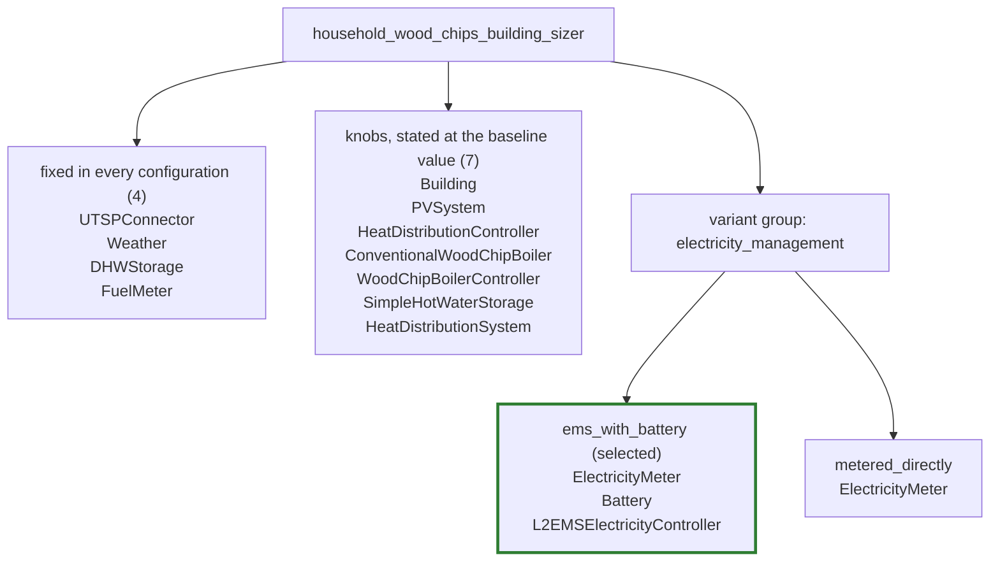

`ElectricityMeter` appears under both options because it is assigned to the group rather than to one option: it is present in every configuration, and each option writes it out in full with its own wiring. The first two boxes together are the grouped file's shared `components:` section — eleven components, of which the seven knobs are the ones whose committed value a consumer replaces — and each option box is that option's own `components:` block, so every component of the setup is on this picture exactly where the grouped file puts it.

### Assignments

| Component | Assignment | Judgement |
| --- | --- | --- |
| `ElectricityMeter` | `variant:electricity_management` | Present in every configuration and wired differently: fed by the energy manager's grid balance when there is one, and by every participant directly when there is not. A group can add and remove a component but cannot rewire one that survives, so this is the row that forces a variant. Written out in full in both options. |
| `Battery` | `variant:electricity_management/ems_with_battery` | Exists only in the world that has an energy manager; the setup builds the two together and there is no battery-without-manager mode. Its capacity also follows the rooftop share, which stays a knob on top of the membership. |
| `L2EMSElectricityController` | `variant:electricity_management/ems_with_battery` | The other half of that world, and the component the meter's two wirings are about. |
| `Building` | `override` | Only the TABULA code moves. The envelope behind it - the U-values, the areas, the heat capacity class - is looked up by the component itself and never written into the file, so one archetype instead of another is a value a consumer picks and the component and its wiring are the same either way. |
| `PVSystem` | `override` | Only the installed peak power moves, and only with the rooftop share. Nothing appears or disappears, so this is a number a consumer picks, not a part of the household. A share of zero is refused when the setup is built, so the knob's range is (0, 1] and no value it can take flips the household into another variant. |
| `HeatDistributionController` | `override` | Radiators change the flow temperature curve this controller is built from. Same component, same wiring, different numbers - a knob, not a switch. |
| `ConventionalWoodChipBoiler` | `override` | Its thermal power band is the building's heating load, so a better insulated envelope buys a smaller wood chip boiler. Same boiler, same wiring, a different rating - the generator's counterpart of the heat pump's set thermal output power. |
| `WoodChipBoilerController` | `override` | Built from the boiler's own minimal and maximal thermal power, so it follows the generator one step further down the same cascade. It does not move with the emitter type, which is why only the archetype column disagrees with it. |
| `SimpleHotWaterStorage` | `override` | The buffer volume is scaled from the heating load under the boiler sizing rule, so it follows the same building demand one step further down. A number the building determines, not a component that comes or goes. |
| `HeatDistributionSystem` | `override` | Radiator or floor heating is one enum plus the water mass flow rate derived from it; the emitter area comes from the building's conditioned floor area and does not move with the emitter type. The emitter is present either way. |

Ordering rule: variant assignments first, then overrides. Within the variant assignments, groups in the order the grouped file's `variants:` section lists them; within a group, the members assigned to the group as a whole before the members assigned to a single option, then the options in the order that section lists them, and within each option the order that option's `components:` block lists them. Within the overrides, the order the shared `components:` section lists them. The judgement text is the note from the grouping table in full, with the YAML line wrapping undone.

### Probe configurations

| Probe column | What it varies | `electricity_management` | Gist |
| --- | --- | --- | --- |
| `baseline` | class defaults | `ems_with_battery` | The class defaults, recorded with no module configuration at all, which is what makes this column's flat file the committed twin: full rooftop photovoltaics, battery and energy manager on, floor heating, and the conventional wood chip boiler this file's family is named for. |
| `no_battery_ems` | `energy_system_config_.use_battery_and_ems = false` | `metered_directly` | The one structural fork this setup has. |
| `half_pv` | `energy_system_config_.share_of_maximum_pv_potential = 0.5` | `ems_with_battery` | Half the rooftop potential. |
| `radiator` | `energy_system_config_.heat_distribution_system = Conventional Radiator` | `ems_with_battery` | Radiators instead of floor heating. |
| `nineties_building` | `archetype_config_.building_code = DE.N.SFH.09.Gen.ReEx.001.002` | `ems_with_battery` | A 1995-2001 single-family house instead of a 1958-1968 one: the same TABULA archetype, one construction-year band later. |

The `What it varies` column is the probe's `module_config` overlay, one `field = value` per line; the baseline column has no overlay at all, which is what "class defaults" means. The `Gist` column is the first sentence of the probe's description; the full description stays in the probe list. Columns are in the order the probe list declares them.

## `simple_air_conditioner_household_building_sizer`

Recorded from `system_setups/simple_air_conditioner_household_building_sizer.py`, described in the grouped file as "Simple air-conditioner household building-sizer system setup." 4 components are shared by every configuration, and the grouped file declares no variant group. One of the shared components is an override, which means the grouped file states the baseline's value for it and a consumer sets that value to something else.

### Shape

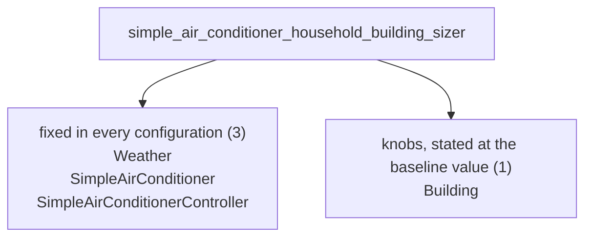

The first two boxes together are the grouped file's shared `components:` section — four components, of which the one knobs are the ones whose committed value a consumer replaces — and the setup has no variant group, so that is every component it has.

### Assignments

| Component | Assignment | Judgement |
| --- | --- | --- |
| `Building` | `override` | Only the TABULA code moves. The envelope behind it - the U-values, the areas, the heat capacity class - is looked up by the component itself and never written into the file, so one archetype instead of another is a value a consumer picks and the component and its wiring are the same either way. It is the only row in this table because the air conditioner and its controller are built from their own class defaults and no sizing context reaches them. |

Ordering rule: variant assignments first, then overrides. Within the variant assignments, groups in the order the grouped file's `variants:` section lists them; within a group, the members assigned to the group as a whole before the members assigned to a single option, then the options in the order that section lists them, and within each option the order that option's `components:` block lists them. Within the overrides, the order the shared `components:` section lists them. The judgement text is the note from the grouping table in full, with the YAML line wrapping undone.

### Probe configurations

| Probe column | What it varies | Gist |
| --- | --- | --- |
| `baseline` | class defaults | The class defaults, recorded with no module configuration at all, which is what makes this column's flat file the committed twin: the 1958-1968 single-family house, its weather, and the air conditioner and controller that both stand at their own class defaults. |
| `nineties_building` | `archetype_config_.building_code = DE.N.SFH.09.Gen.ReEx.001.002` | A 1995-2001 single-family house instead of a 1958-1968 one: the same TABULA archetype, one construction-year band later. |

The `What it varies` column is the probe's `module_config` overlay, one `field = value` per line; the baseline column has no overlay at all, which is what "class defaults" means. The `Gist` column is the first sentence of the probe's description; the full description stays in the probe list. Columns are in the order the probe list declares them.

## `air_conditioned_house`

Recorded from `system_setups/air_conditioned_house.py`, described in the recorded twin as "Air-conditioned household." Its 7 components are listed below. Not grouped yet: a single recorded configuration, no probe list, so the page can state its inventory and nothing else.

### Shape

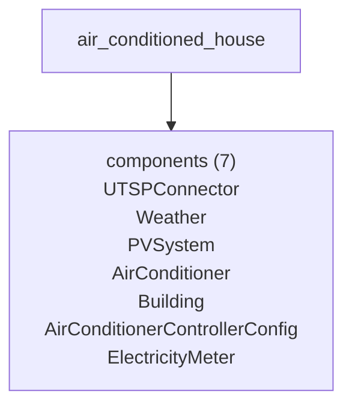

## `automatic_default_connections`

Recorded from `system_setups/automatic_default_connections.py`, described in the recorded twin as "Household with automatic default connections." Its 12 components are listed below. Not grouped yet: a single recorded configuration, no probe list, so the page can state its inventory and nothing else.

### Shape

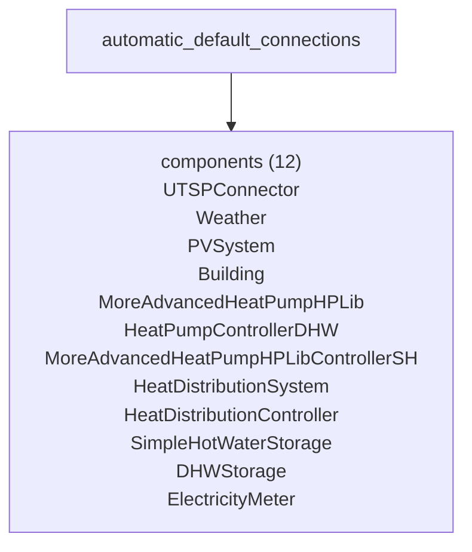

## `basic_household`

Recorded from `system_setups/basic_household.py`, described in the recorded twin as "Basic household system setup. Shows how to set up a standard system." Its 7 components are listed below. Not grouped yet: a single recorded configuration, no probe list, so the page can state its inventory and nothing else.

### Shape

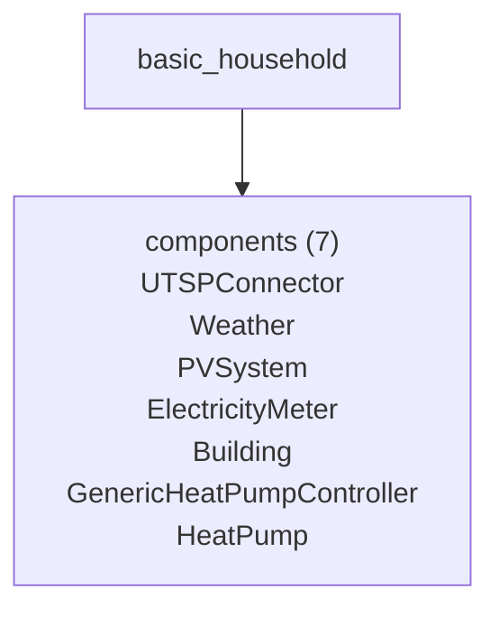

## `basic_household_only_heating`

Recorded from `system_setups/basic_household_only_heating.py`, described in the recorded twin as "Shows a single household with only heating." Its 10 components are listed below. Not grouped yet: a single recorded configuration, no probe list, so the page can state its inventory and nothing else.

### Shape

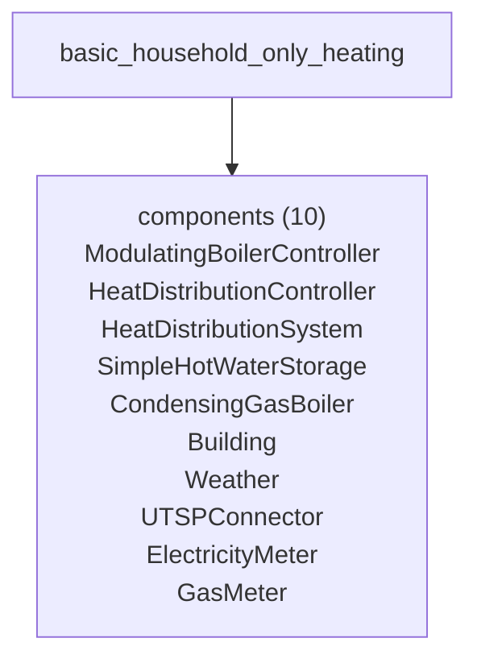

## `default_connections`

Recorded from `system_setups/default_connections.py`, described in the recorded twin as "Default Connections Module." Its 7 components are listed below. Not grouped yet: a single recorded configuration, no probe list, so the page can state its inventory and nothing else.

### Shape

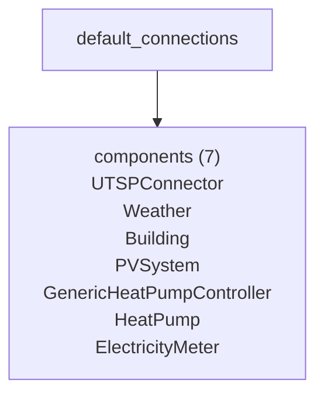

## `dynamic_components`

Recorded from `system_setups/dynamic_components.py`, described in the recorded twin as "Dynamic Components Module." Its 8 components are listed below. Not grouped yet: a single recorded configuration, no probe list, so the page can state its inventory and nothing else.

### Shape

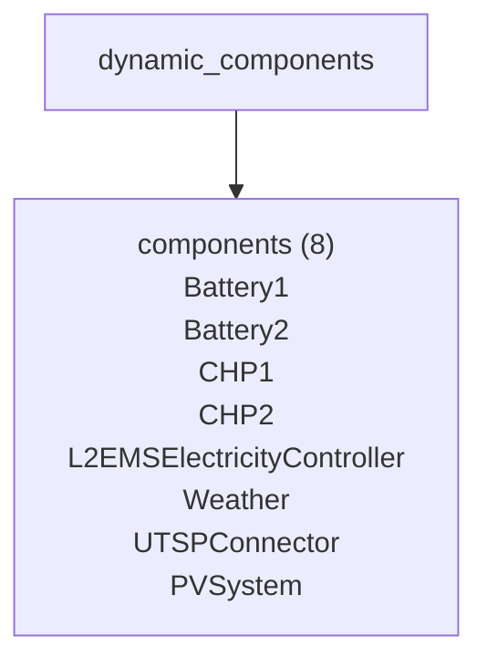

## `electrolyzer_with_renewables`

Recorded from `system_setups/electrolyzer_with_renewables.py`, described in the recorded twin as "Simple Electrolyzer system setup." Its 4 components are listed below. Not grouped yet: a single recorded configuration, no probe list, so the page can state its inventory and nothing else.

### Shape

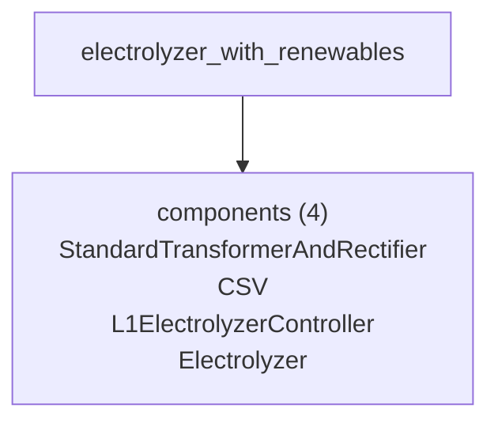

## `simple_system_setup_one`

Recorded from `system_setups/simple_system_setup_one.py`, described in the recorded twin as "Simple System Setup Module." Its 3 components are listed below. Not grouped yet: a single recorded configuration, no probe list, so the page can state its inventory and nothing else.

### Shape

```mermaid
flowchart TD
    setup["simple_system_setup_one"]
    components["components (3)<br/>RandomNumbers100To200<br/>RandomNumbers10To20<br/>Sum"]

    setup --> components
```

## `simple_system_setup_two`

Recorded from `system_setups/simple_system_setup_two.py`, described in the recorded twin as "Simple System Setup Module." Its 4 components are listed below. Not grouped yet: a single recorded configuration, no probe list, so the page can state its inventory and nothing else.

### Shape

```mermaid
flowchart TD
    setup["simple_system_setup_two"]
    components["components (4)<br/>RandomNumbers100To200<br/>RandomNumbers10To20<br/>ExampleTransformerDefault<br/>Sum"]

    setup --> components
```
